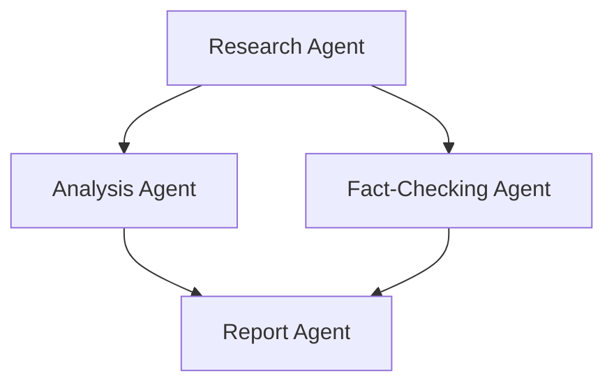
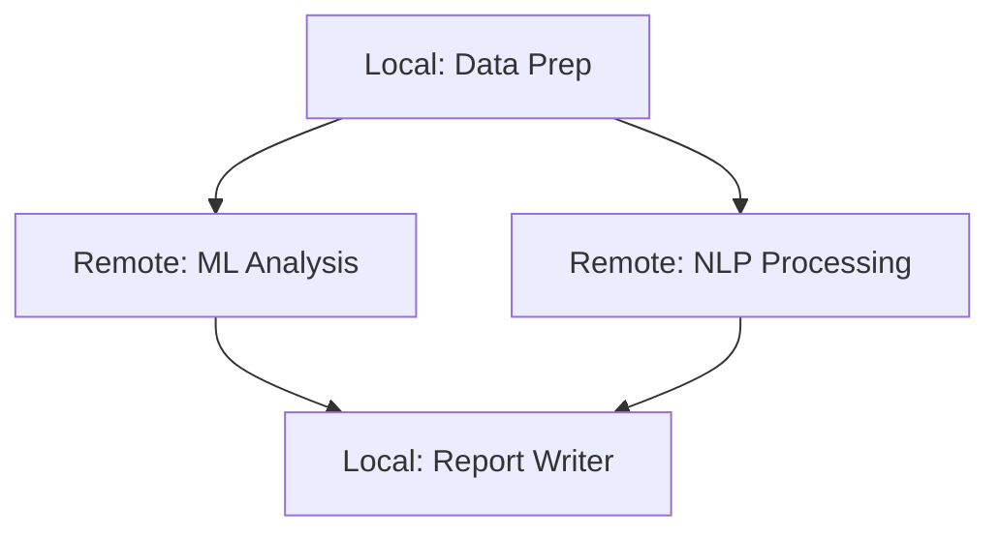
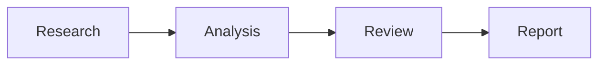
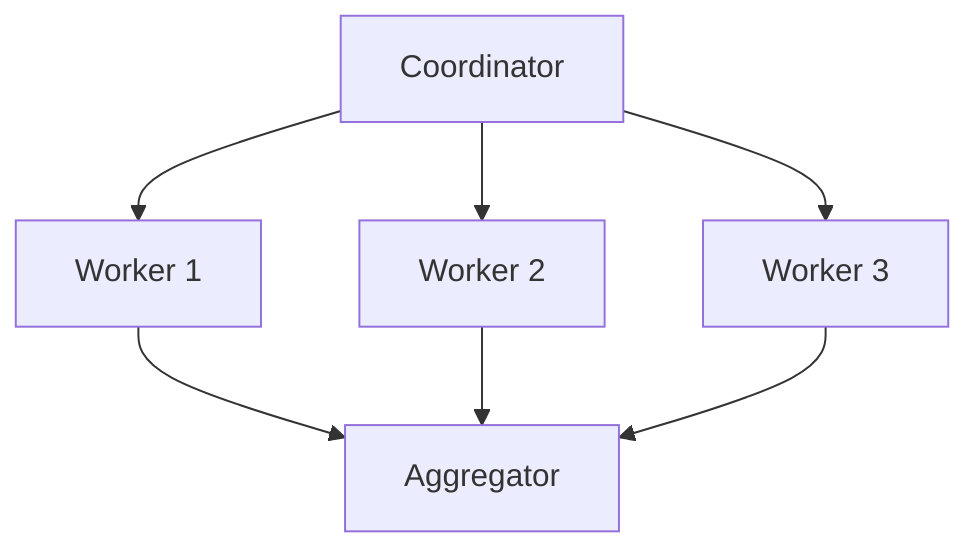
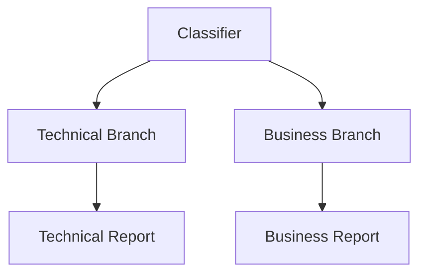
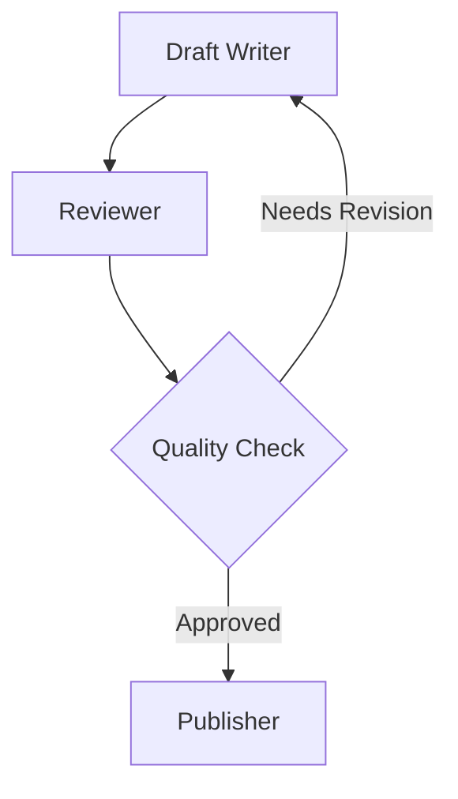

A Graph is a deterministic directed graph based agent orchestration system where agents, custom nodes, or other multi-agent systems (like [Swarm](lc:user-guide/concepts/multi-agent/swarm) or nested Graphs) are nodes in a graph. Nodes are executed according to edge dependencies, with output from one node passed as input to connected nodes. The Graph pattern supports both acyclic (DAG) and cyclic topologies, enabling feedback loops and iterative refinement workflows.

-   **Deterministic execution order** based on graph structure
-   **Output propagation** along edges between nodes
-   **Clear dependency management** between agents
-   **Nested pattern support** (Graph as a node in another Graph)
-   **Remote agent support** via A2AAgent for distributed workflows
-   **Custom node types** for deterministic business logic and hybrid workflows
-   **Conditional edge traversal** for dynamic workflows
-   **Cyclic graph support** with execution limits and state management
-   **Multi-modal input support** for handling text, images, and other content types

## How Graphs Work

The Graph pattern operates on the principle of structured, deterministic workflows where:

1.  Nodes represent agents, custom nodes, or multi-agent systems
2.  Edges define dependencies and information flow between nodes
3.  Execution follows the graph structure, respecting dependencies
    1.  When multiple nodes have edges to a target node, the default behavior for when the target executes varies by SDK. See the [Conditional Edges](#conditional-edges) section for dynamic traversal.
4.  Output from one node becomes input for dependent nodes
5.  Entry points receive the original task as input
6.  Nodes can be revisited in cyclic patterns with proper exit conditions



## Graph Components

```sa-tabs
[
 {
  "label": "Python",
  "body": "**1\\. GraphNode**\n\nA [`GraphNode`](lc:api/python/strands.multiagent.graph#GraphNode) represents a node in the graph with:\n\n-   **node\\_id**: Unique identifier for the node\n-   **executor**: The Agent, A2AAgent, or MultiAgentBase instance to execute\n-   **dependencies**: Set of nodes this node depends on\n-   **execution\\_status**: Current status (PENDING, EXECUTING, COMPLETED, FAILED)\n-   **result**: The NodeResult after execution\n-   **execution\\_time**: Time taken to execute the node in milliseconds\n\n**2\\. GraphEdge**\n\nA [`GraphEdge`](lc:api/python/strands.multiagent.graph#GraphEdge) represents a connection between nodes with:\n\n-   **from\\_node**: Source node\n-   **to\\_node**: Target node\n-   **condition**: Optional function that determines if the edge should be traversed\n\n**3\\. GraphBuilder**\n\nThe [`GraphBuilder`](lc:api/python/strands.multiagent.graph#GraphBuilder) provides a simple interface for constructing graphs:\n\n-   **add\\_node()**: Add an agent or multi-agent system as a node\n-   **add\\_edge()**: Create a dependency between nodes\n-   **set\\_entry\\_point()**: Define starting nodes for execution\n-   **set\\_max\\_node\\_executions()**: Limit total node executions (useful for cyclic graphs)\n-   **set\\_execution\\_timeout()**: Set maximum execution time\n-   **set\\_node\\_timeout()**: Set timeout for individual nodes\n-   **reset\\_on\\_revisit()**: Control whether nodes reset state when revisited\n-   **build()**: Validate and create the Graph instance"
 },
 {
  "label": "TypeScript",
  "body": "**Nodes**\n\nNodes wrap agents or other orchestrators for execution within the graph. The SDK provides two built-in node types:\n\n-   **AgentNode**: Wraps an `AgentBase` instance. Created automatically when you pass an agent to the `nodes` array. Uses the agent\u2019s `id` as the node identifier.\n-   **MultiAgentNode**: Wraps a `MultiAgentBase` instance (e.g. another `Graph` or `Swarm`). Created automatically when you pass an orchestrator to the `nodes` array. Uses the orchestrator\u2019s `id` as the node identifier.\n\n**Edges**\n\nEdges define directed connections between nodes. They can be specified as simple tuples or with an optional handler for conditional traversal:\n\n-   **`[source, target]`**: Tuple of node IDs for unconditional edges\n-   **`{ source, target, handler }`**: Object with an optional `EdgeHandler` function for conditional traversal\n\n**Graph Constructor**\n\nThe `Graph` constructor accepts:\n\n-   **nodes**: Array of `AgentBase`, `MultiAgentBase`, or `Node` instances\n-   **edges**: Array of edge definitions (tuples or objects with handlers)\n-   **sources**: Entry point node IDs (auto-detected from nodes with no incoming edges)\n-   **maxSteps**: Maximum total node executions (useful for cyclic graphs). Defaults to `Infinity`.\n-   **maxConcurrency**: Maximum nodes executing in parallel. Defaults to `Infinity`.\n-   **timeout**: Wall-clock ceiling for the entire graph invocation, in milliseconds. Defaults to `Infinity`. Does not propagate into nested orchestrators wrapped via `MultiAgentNode`; nested `Swarm`/`Graph` instances run under their own timeout config.\n-   **nodeTimeout**: Fallback per-node wall-clock ceiling in milliseconds. Applied to any `AgentNode` that does not set its own `timeout`. Defaults to `Infinity`. Does not apply to `MultiAgentNode`.\n-   **plugins**: Plugins for event-driven extensibility\n\nTo bound an individual `AgentNode`, pass `timeout` to its options object instead of relying on the orchestrator\u2019s `nodeTimeout`. Per-node `timeout` overrides `nodeTimeout` for that node and must be at least 1 ms.\n\nEach `AgentNode` snapshots the wrapped agent\u2019s state before execution and restores it afterward, so a node visited multiple times runs from a clean slate.\n\nSet `preserveContext: true` on the node to opt out: `new AgentNode({ agent: analyst, preserveContext: true })`. The wrapped agent then accumulates messages, app state, and model state across executions, which suits revisited nodes that build on prior work like iterative refinement.\n\n`preserveContext: true` requires an `Agent` instance; passing it with a non-`Agent` `InvokableAgent` throws at construction time.\n\nIf neither `maxSteps` nor `timeout` is set, the SDK emits a one-time warning at construction since a graph with cyclic edges and no bound can run indefinitely.\n\nTimeouts are enforced via `AbortSignal` and are cooperative. A tool that neither polls its cancel signal nor forwards it to a cancellable API can run past the deadline."
 }
]
```

## Creating a Graph

```sa-tabs
[
 {
  "label": "Python",
  "body": "To create a [`Graph`](lc:api/python/strands.multiagent.graph#Graph), you use the [`GraphBuilder`](lc:api/python/strands.multiagent.graph#GraphBuilder) to define nodes, edges, and entry points:\n\n```python\nimport logging\nfrom strands import Agent\nfrom strands.multiagent import GraphBuilder\n\n# Enable debug logs and print them to stderr\nlogging.getLogger(\"strands.multiagent\").setLevel(logging.DEBUG)\nlogging.basicConfig(\n    format=\"%(levelname)s | %(name)s | %(message)s\",\n    handlers=[logging.StreamHandler()]\n)\n\n# Create specialized agents\nresearcher = Agent(name=\"researcher\", system_prompt=\"You are a research specialist...\")\nanalyst = Agent(name=\"analyst\", system_prompt=\"You are a data analysis specialist...\")\nfact_checker = Agent(name=\"fact_checker\", system_prompt=\"You are a fact checking specialist...\")\nreport_writer = Agent(name=\"report_writer\", system_prompt=\"You are a report writing specialist...\")\n\n# Build the graph\nbuilder = GraphBuilder()\n\n# Add nodes\nbuilder.add_node(researcher, \"research\")\nbuilder.add_node(analyst, \"analysis\")\nbuilder.add_node(fact_checker, \"fact_check\")\nbuilder.add_node(report_writer, \"report\")\n\n# Add edges (dependencies)\nbuilder.add_edge(\"research\", \"analysis\")\nbuilder.add_edge(\"research\", \"fact_check\")\nbuilder.add_edge(\"analysis\", \"report\")\nbuilder.add_edge(\"fact_check\", \"report\")\n\n# Set entry points (optional - will be auto-detected if not specified)\nbuilder.set_entry_point(\"research\")\n\n# Optional: Configure execution limits for safety\nbuilder.set_execution_timeout(600)   # 10 minute timeout\n\n# Build the graph\ngraph = builder.build()\n\n# Execute the graph on a task\nresult = graph(\"Research the impact of AI on healthcare and create a comprehensive report\")\n# Or use invoke_async for async execution: result = await graph.invoke_async(...)\n\n# Access the results\nprint(f\"\\nStatus: {result.status}\")\nprint(f\"Execution order: {[node.node_id for node in result.execution_order]}\")\n```"
 },
 {
  "label": "TypeScript",
  "body": "```typescript\n// Create specialized agents\nconst researcher = new Agent({\n  id: 'research',\n  systemPrompt: 'You are a research specialist...',\n})\n\nconst analyst = new Agent({\n  id: 'analysis',\n  systemPrompt: 'You are a data analysis specialist...',\n})\n\nconst factChecker = new Agent({\n  id: 'fact_check',\n  systemPrompt: 'You are a fact checking specialist...',\n})\n\nconst reportWriter = new Agent({\n  id: 'report',\n  systemPrompt: 'You are a report writing specialist...',\n})\n\n// Build the graph with nodes and edges\nconst graph = new Graph({\n  nodes: [researcher, analyst, factChecker, reportWriter],\n  edges: [\n    ['research', 'analysis'],\n    ['research', 'fact_check'],\n    ['analysis', 'report'],\n    ['fact_check', 'report'],\n  ],\n  // Optional: specify entry points (auto-detected from nodes with no incoming edges)\n  sources: ['research'],\n  // Optional: configure execution limits for safety\n  maxSteps: 20,\n})\n\n// Execute the graph on a task\nconst result = await graph.invoke(\n  'Research the impact of AI on healthcare and create a comprehensive report'\n)\n\n// Access the results\nconsole.log('Status:', result.status)\nconsole.log('Execution order:', result.results.map((r) => r.nodeId).join(' -> '))\n```"
 }
]
```

## Conditional Edges

You can add conditional logic to edges to create dynamic workflows:

```sa-tabs
[
 {
  "label": "Python",
  "body": "```python\ndef only_if_research_successful(state):\n    \"\"\"Only traverse if research was successful.\"\"\"\n    research_node = state.results.get(\"research\")\n    if not research_node:\n        return False\n\n    # Check if research result contains success indicator\n    result_text = str(research_node.result)\n    return \"successful\" in result_text.lower()\n\n# Add conditional edge\nbuilder.add_edge(\"research\", \"analysis\", condition=only_if_research_successful)\n```"
 },
 {
  "label": "TypeScript",
  "body": "```typescript\nconst onlyIfResearchSuccessful: EdgeHandler = (state) => {\n  const resultText = state\n    .node('research')!\n    .content.map((b) => ('text' in b ? b.text : ''))\n    .join('')\n  return resultText.toLowerCase().includes('successful')\n}\n\n// Add conditional edge\nconst graph = new Graph({\n  nodes: [researcher, analyst],\n  edges: [\n    { source: 'research', target: 'analysis', handler: onlyIfResearchSuccessful },\n  ],\n})\n```"
 }
]
```

### Conditional Edges with Runtime Context

> [!NOTE] Python only
>
> This feature is currently available in the Python SDK only.

Edge conditions can optionally receive an `invocation_state` dictionary, enabling routing decisions based on runtime context such as feature flags, user roles, or environment-specific configuration. This is passed during graph invocation and forwarded to conditions that accept it.

Both signatures are supported — existing conditions that only accept `state` continue to work without changes.

```python
from strands import Agent
from strands.multiagent import GraphBuilder
from strands.multiagent.graph import GraphState

# New-style condition: receives invocation_state for runtime routing
def requires_admin(state: GraphState, *, invocation_state: dict, **kwargs) -> bool:
    """Only traverse if the invoking user has admin role."""
    return invocation_state.get("role") == "admin"

def requires_feature_flag(state: GraphState, *, invocation_state: dict, **kwargs) -> bool:
    """Only traverse if the experimental feature is enabled."""
    return invocation_state.get("enable_experimental", False)

# Build the graph with conditional routing
builder = GraphBuilder()
builder.add_node(router, "router")
builder.add_node(admin_panel, "admin_panel")
builder.add_node(experimental_feature, "experimental")
builder.add_node(standard_path, "standard")

builder.add_edge("router", "admin_panel", condition=requires_admin)
builder.add_edge("router", "experimental", condition=requires_feature_flag)
builder.add_edge("router", "standard")

graph = builder.build()

# Pass runtime context at invocation time
result = graph("Process this request", invocation_state={"role": "admin", "enable_experimental": True})
```

The `invocation_state` dictionary is:

-   Passed to every `EdgeConditionWithContext` condition during edge evaluation
-   Persisted across interrupt/resume cycles (serialized with the graph checkpoint)
-   Available via the [`EdgeConditionWithContext`](lc:api/python/strands.multiagent.graph#EdgeConditionWithContext) protocol

Legacy conditions (`Callable[[GraphState], bool]`) are detected automatically and called with only `state` — no migration is required.

### Waiting for All Dependencies

> [!NOTE] Python only
>
> In Python, the default behavior is OR semantics — a target node fires when **any** incoming edge’s source completes. Use conditional edges to explicitly wait for all dependencies. In other SDKs, AND semantics are the default.

```python
from strands.multiagent.graph import GraphState
from strands.multiagent.base import Status

def all_dependencies_complete(required_nodes: list[str]):
    """Factory function to create AND condition for multiple dependencies."""
    def check_all_complete(state: GraphState) -> bool:
        return all(
            node_id in state.results and state.results[node_id].status == Status.COMPLETED
            for node_id in required_nodes
        )
    return check_all_complete

# Z will only execute when A AND B AND C have all completed
builder.add_edge("A", "Z", condition=all_dependencies_complete(["A", "B", "C"]))
builder.add_edge("B", "Z", condition=all_dependencies_complete(["A", "B", "C"]))
builder.add_edge("C", "Z", condition=all_dependencies_complete(["A", "B", "C"]))
```

## Nested Multi-Agent Patterns

You can use a Graph or Swarm as a node within another Graph:

```sa-tabs
[
 {
  "label": "Python",
  "body": "```python\nfrom strands import Agent\nfrom strands.multiagent import GraphBuilder, Swarm\n\n# Create a swarm of research agents\nresearch_agents = [\n    Agent(name=\"medical_researcher\", system_prompt=\"You are a medical research specialist...\"),\n    Agent(name=\"technology_researcher\", system_prompt=\"You are a technology research specialist...\"),\n    Agent(name=\"economic_researcher\", system_prompt=\"You are an economic research specialist...\")\n]\nresearch_swarm = Swarm(research_agents)\n\n# Create a single agent node too\nanalyst = Agent(system_prompt=\"Analyze the provided research.\")\n\n# Create a graph with the swarm as a node\nbuilder = GraphBuilder()\nbuilder.add_node(research_swarm, \"research_team\")\nbuilder.add_node(analyst, \"analysis\")\nbuilder.add_edge(\"research_team\", \"analysis\")\n\ngraph = builder.build()\n\nresult = graph(\"Research the impact of AI on healthcare and create a comprehensive report\")\n\n# Access the results\nprint(f\"\\n{result}\")\n```"
 },
 {
  "label": "TypeScript",
  "body": "```typescript\nconst medicalResearcher = new Agent({\n  id: 'medical_researcher',\n  systemPrompt: 'You are a medical research specialist...',\n})\n\nconst technologyResearcher = new Agent({\n  id: 'technology_researcher',\n  systemPrompt: 'You are a technology research specialist...',\n})\n\nconst economicResearcher = new Agent({\n  id: 'economic_researcher',\n  systemPrompt: 'You are an economic research specialist...',\n})\n\n// Create a swarm of research agents\nconst researchSwarm = new Swarm({\n  id: 'research_swarm',\n  nodes: [medicalResearcher, technologyResearcher, economicResearcher],\n})\n\n// Create a single agent node\nconst analyst = new Agent({\n  id: 'analysis',\n  systemPrompt: 'Analyze the provided research.',\n})\n\n// Create a graph with the swarm as a node\nconst graph = new Graph({\n  nodes: [researchSwarm, analyst],\n  edges: [['research_swarm', 'analysis']],\n})\n\nconst result = await graph.invoke(\n  'Research the impact of AI on healthcare and create a comprehensive report'\n)\nconsole.log(result)\n```"
 }
]
```

## Remote Agents with A2AAgent

Graphs support remote A2A agents as nodes through the [`A2AAgent`](lc:user-guide/concepts/multi-agent/agent-to-agent#consuming-remote-agents) class. You can add it directly to a graph just like a local agent. This enables distributed architectures where orchestration happens locally while specialized tasks run on remote services.



```sa-tabs
[
 {
  "label": "Python",
  "body": "```python\nimport asyncio\nfrom strands import Agent\nfrom strands.agent.a2a_agent import A2AAgent\nfrom strands.multiagent import GraphBuilder\n\n# Local agents for orchestration\ndata_prep = Agent(\n    name=\"data_prep\",\n    system_prompt=\"You prepare data for analysis, cleaning and formatting as needed.\"\n)\nreport_writer = Agent(\n    name=\"report_writer\",\n    system_prompt=\"You synthesize analysis results into clear, actionable reports.\"\n)\n\n# Remote specialized services\nml_analyzer = A2AAgent(\n    endpoint=\"http://ml-service:9000\",\n    name=\"ml_analyzer\",\n    timeout=600  # Allow more time for ML operations\n)\nnlp_processor = A2AAgent(\n    endpoint=\"http://nlp-service:9000\",\n    name=\"nlp_processor\"\n)\n\n# Build the distributed graph\nbuilder = GraphBuilder()\nbuilder.add_node(data_prep, \"prep\")\nbuilder.add_node(ml_analyzer, \"ml\")\nbuilder.add_node(nlp_processor, \"nlp\")\nbuilder.add_node(report_writer, \"report\")\n\nbuilder.add_edge(\"prep\", \"ml\")\nbuilder.add_edge(\"prep\", \"nlp\")\nbuilder.add_edge(\"ml\", \"report\")\nbuilder.add_edge(\"nlp\", \"report\")\n\nbuilder.set_execution_timeout(900)\ngraph = builder.build()\n\n# Execute the distributed workflow\nasync def main():\n    result = await graph.invoke_async(\"Analyze customer feedback from Q4 2024\")\n    print(f\"Status: {result.status}\")\n\nasyncio.run(main())\n```"
 },
 {
  "label": "TypeScript",
  "body": "```typescript\n// Local agents for orchestration\nconst dataPrep = new Agent({\n  id: 'prep',\n  systemPrompt: 'You prepare data for analysis, cleaning and formatting as needed.',\n})\n\nconst reportWriter = new Agent({\n  id: 'report',\n  systemPrompt: 'You synthesize analysis results into clear, actionable reports.',\n})\n\n// Remote specialized services\nconst mlAnalyzer = new A2AAgent({ url: 'http://ml-service:9000', id: 'ml' })\nconst nlpProcessor = new A2AAgent({ url: 'http://nlp-service:9000', id: 'nlp' })\n\n// Build the distributed graph\nconst graph = new Graph({\n  nodes: [dataPrep, mlAnalyzer, nlpProcessor, reportWriter],\n  edges: [\n    ['prep', 'ml'],\n    ['prep', 'nlp'],\n    ['ml', 'report'],\n    ['nlp', 'report'],\n  ],\n})\n\n// Execute the distributed workflow\nconst result = await graph.invoke('Analyze customer feedback from Q4 2024')\nconsole.log('Status:', result.status)\n```"
 }
]
```

## Custom Node Types

You can create custom node types to implement deterministic business logic, data processing pipelines, and hybrid workflows.

```sa-tabs
[
 {
  "label": "Python",
  "body": "Extend [`MultiAgentBase`](lc:api/python/strands.multiagent.base#MultiAgentBase) to create custom nodes:\n\n```python\nfrom strands.multiagent.base import MultiAgentBase, NodeResult, Status, MultiAgentResult\nfrom strands.agent.agent_result import AgentResult\nfrom strands.types.content import ContentBlock, Message\n\nclass FunctionNode(MultiAgentBase):\n    \"\"\"Execute deterministic Python functions as graph nodes.\"\"\"\n\n    def __init__(self, func, name: str = None):\n        super().__init__()\n        self.func = func\n        self.name = name or func.__name__\n\n    async def invoke_async(self, task, invocation_state, **kwargs):\n        # Execute function and create AgentResult\n        result = self.func(task if isinstance(task, str) else str(task))\n\n        agent_result = AgentResult(\n            stop_reason=\"end_turn\",\n            message=Message(role=\"assistant\", content=[ContentBlock(text=str(result))]),\n            # ... metrics and state\n        )\n\n        # Return wrapped in MultiAgentResult\n        return MultiAgentResult(\n            status=Status.COMPLETED,\n            results={self.name: NodeResult(result=agent_result, ...)},\n            # ... execution details\n        )\n\n# Usage example\ndef validate_data(data):\n    if not data.strip():\n        raise ValueError(\"Empty input\")\n    return f\"\u2705 Validated: {data[:50]}...\"\n\nvalidator = FunctionNode(func=validate_data, name=\"validator\")\nbuilder.add_node(validator, \"validator\")\n```"
 },
 {
  "label": "TypeScript",
  "body": "Extend `Node` and implement the `handle` method:\n\n```typescript\nclass ValidatorNode extends Node {\n  async *handle(\n    args: string | ContentBlock[],\n    _state: MultiAgentState\n  ): AsyncGenerator<MultiAgentStreamEvent, NodeResultUpdate, undefined> {\n    const input = typeof args === 'string' ? args : ''\n\n    if (!input.trim()) {\n      throw new Error('Empty input')\n    }\n\n    return { content: [new TextBlock(`Validated: ${input.slice(0, 50)}...`)] }\n  }\n}\n\n// Pass the custom node directly to the graph\nconst validator = new ValidatorNode('validator', { description: 'Validates input data' })\nconst processor = new Agent({\n  id: 'processor',\n  systemPrompt: 'Process the validated data.',\n})\n\nconst pipelineGraph = new Graph({\n  nodes: [validator, processor],\n  edges: [['validator', 'processor']],\n})\n```"
 }
]
```

Custom nodes enable:

-   **Deterministic processing**: Guarantee execution for business logic
-   **Performance optimization**: Skip LLM calls for deterministic operations
-   **Hybrid workflows**: Combine AI creativity with deterministic control
-   **Business rules**: Implement complex business logic as graph nodes

## Multi-Modal Input Support

Graphs support multi-modal inputs like text and images:

```sa-tabs
[
 {
  "label": "Python",
  "body": "```python\nfrom strands import Agent\nfrom strands.multiagent import GraphBuilder\nfrom strands.types.content import ContentBlock\n\n# Create agents for image processing workflow\nimage_analyzer = Agent(system_prompt=\"You are an image analysis expert...\")\nsummarizer = Agent(system_prompt=\"You are a summarization expert...\")\n\n# Build the graph\nbuilder = GraphBuilder()\nbuilder.add_node(image_analyzer, \"image_analyzer\")\nbuilder.add_node(summarizer, \"summarizer\")\nbuilder.add_edge(\"image_analyzer\", \"summarizer\")\nbuilder.set_entry_point(\"image_analyzer\")\n\ngraph = builder.build()\n\n# Create content blocks with text and image\ncontent_blocks = [\n    ContentBlock(text=\"Analyze this image and describe what you see:\"),\n    ContentBlock(image={\"format\": \"png\", \"source\": {\"bytes\": image_bytes}}),\n]\n\n# Execute the graph with multi-modal input\nresult = graph(content_blocks)\n```"
 },
 {
  "label": "TypeScript",
  "body": "```typescript\n// Create agents for image processing workflow\nconst imageAnalyzer = new Agent({\n  id: 'image_analyzer',\n  systemPrompt: 'You are an image analysis expert...',\n})\n\nconst summarizer = new Agent({\n  id: 'summarizer',\n  systemPrompt: 'You are a summarization expert...',\n})\n\n// Build the graph\nconst graph = new Graph({\n  nodes: [imageAnalyzer, summarizer],\n  edges: [['image_analyzer', 'summarizer']],\n  sources: ['image_analyzer'],\n})\n\n// Create content blocks with text and image\nconst imageBytes = new Uint8Array(/* your image data */)\nconst contentBlocks = [\n  new TextBlock('Analyze this image and describe what you see:'),\n  new ImageBlock({ format: 'png', source: { bytes: imageBytes } }),\n]\n\n// Execute the graph with multi-modal input\nconst result = await graph.invoke(contentBlocks)\n```"
 }
]
```

## Streaming Events

Graphs support real-time streaming of events during execution. This provides visibility into node execution, parallel processing, and nested multi-agent systems.

```sa-tabs
[
 {
  "label": "Python",
  "body": "```python\nfrom strands import Agent\nfrom strands.multiagent import GraphBuilder\n\n# Create specialized agents\nresearcher = Agent(name=\"researcher\", system_prompt=\"You are a research specialist...\")\nanalyst = Agent(name=\"analyst\", system_prompt=\"You are an analysis specialist...\")\n\n# Build the graph\nbuilder = GraphBuilder()\nbuilder.add_node(researcher, \"research\")\nbuilder.add_node(analyst, \"analysis\")\nbuilder.add_edge(\"research\", \"analysis\")\nbuilder.set_entry_point(\"research\")\ngraph = builder.build()\n\n# Stream events during execution\nasync for event in graph.stream_async(\"Research and analyze market trends\"):\n    # Track node execution\n    if event.get(\"type\") == \"multiagent_node_start\":\n        print(f\"\ud83d\udd04 Node {event['node_id']} starting\")\n\n    # Monitor agent events within nodes\n    elif event.get(\"type\") == \"multiagent_node_stream\":\n        inner_event = event[\"event\"]\n        if \"data\" in inner_event:\n            print(inner_event[\"data\"], end=\"\")\n\n    # Track node completion\n    elif event.get(\"type\") == \"multiagent_node_stop\":\n        node_result = event[\"node_result\"]\n        print(f\"\\n\u2705 Node {event['node_id']} completed in {node_result.execution_time}ms\")\n\n    # Get final result\n    elif event.get(\"type\") == \"multiagent_result\":\n        result = event[\"result\"]\n        print(f\"Graph completed: {result.status}\")\n```"
 },
 {
  "label": "TypeScript",
  "body": "```typescript\nconst graph = new Graph({\n  nodes: [researcher, analyst],\n  edges: [['research', 'analysis']],\n  sources: ['research'],\n})\n\nfor await (const event of graph.stream('Research and analyze market trends')) {\n  switch (event.type) {\n    // Track node execution\n    case 'beforeNodeCallEvent':\n      console.log(`\\n\ud83d\udd04 Node ${event.nodeId} starting`)\n      break\n\n    // Monitor node completion\n    case 'nodeResultEvent':\n      console.log(`\\n\u2705 Node ${event.nodeId} completed in ${event.result.duration}ms`)\n      break\n\n    // Track handoffs between nodes\n    case 'multiAgentHandoffEvent':\n      console.log(`\\n\ud83d\udd00 Handoff: ${event.source} -> ${event.targets.join(', ')}`)\n      break\n\n    // Get final result\n    case 'multiAgentResultEvent':\n      console.log(`\\nGraph completed: ${event.result.status}`)\n      break\n  }\n}\n```"
 }
]
```

See the [streaming overview](lc:user-guide/concepts/streaming#multi-agent-events) for details on all multi-agent event types.

## Graph Results

When a Graph completes execution, it returns a result object with detailed information:

```sa-tabs
[
 {
  "label": "Python",
  "body": "```python\nresult = graph(\"Research and analyze...\")\n\n# Check execution status\nprint(f\"Status: {result.status}\")  # COMPLETED, FAILED, etc.\n\n# See which nodes were executed and in what order\nfor node in result.execution_order:\n    print(f\"Executed: {node.node_id}\")\n\n# Get results from specific nodes\nanalysis_result = result.results[\"analysis\"].result\nprint(f\"Analysis: {analysis_result}\")\n\n# Get performance metrics\nprint(f\"Total nodes: {result.total_nodes}\")\nprint(f\"Completed nodes: {result.completed_nodes}\")\nprint(f\"Failed nodes: {result.failed_nodes}\")\nprint(f\"Execution time: {result.execution_time}ms\")\nprint(f\"Token usage: {result.accumulated_usage}\")\n```"
 },
 {
  "label": "TypeScript",
  "body": "```typescript\nconst graph = new Graph({\n  nodes: [researcher, analyst],\n  edges: [['research', 'analysis']],\n})\n\nconst result = await graph.invoke('Research and analyze...')\n\n// Check execution status\nconsole.log('Status:', result.status)\n\n// See which nodes were executed\nfor (const nodeResult of result.results) {\n  console.log(`Node: ${nodeResult.nodeId}, Status: ${nodeResult.status}`)\n}\n\n// Get performance metrics\nconsole.log('Duration:', result.duration, 'ms')\n\n// Get the final output\nconsole.log('Output:', result.content.find((b) => b.type === 'textBlock')?.text)\n```"
 }
]
```

## Input Propagation

The Graph automatically builds input for each node based on its dependencies:

1.  **Entry point nodes** receive the original task as input
2.  **Dependent nodes** receive a combined input that includes:
    -   The original task
    -   Results from all dependency nodes that have completed execution

This ensures each node has access to both the original context and the outputs from its dependencies.

## Shared State

Graphs support passing shared state to all agents. This enables sharing context and configuration across agents without exposing it to the LLM.

For detailed information about shared state, including examples and best practices, see [Shared State Across Multi-Agent Patterns](lc:user-guide/concepts/multi-agent/multi-agent-patterns#shared-state-across-multi-agent-patterns).

## Graphs as a Tool

> [!NOTE] Python only
>
> The `graph` tool is available in the [Strands tools package](lc:user-guide/concepts/tools/community-tools-package) for Python.

Agents can dynamically create and orchestrate graphs by using the `graph` tool:

```python
from strands import Agent
from strands_tools import graph

agent = Agent(tools=[graph], system_prompt="Create a graph of agents to solve the user's query.")

agent("Design a TypeScript REST API and then write the code for it")
```

In this example:

1.  The agent uses the `graph` tool to dynamically create nodes and edges in a graph. These nodes might be architect, coder, and reviewer agents with edges defined as architect -> coder -> reviewer
2.  Next the agent executes the graph
3.  The agent analyzes the graph results and then decides to either create another graph and execute it, or answer the user’s query

## Common Graph Topologies

### 1\. Sequential Pipeline



```sa-tabs
[
 {
  "label": "Python",
  "body": "```python\nbuilder = GraphBuilder()\nbuilder.add_node(researcher, \"research\")\nbuilder.add_node(analyst, \"analysis\")\nbuilder.add_node(reviewer, \"review\")\nbuilder.add_node(report_writer, \"report\")\n\nbuilder.add_edge(\"research\", \"analysis\")\nbuilder.add_edge(\"analysis\", \"review\")\nbuilder.add_edge(\"review\", \"report\")\n```"
 },
 {
  "label": "TypeScript",
  "body": "```typescript\nconst graph = new Graph({\n  nodes: [researcher, analyst, reviewer, reportWriter],\n  edges: [\n    ['research', 'analysis'],\n    ['analysis', 'review'],\n    ['review', 'report'],\n  ],\n})\n```"
 }
]
```

### 2\. Parallel Processing with Aggregation



```sa-tabs
[
 {
  "label": "Python",
  "body": "```python\nbuilder = GraphBuilder()\nbuilder.add_node(coordinator, \"coordinator\")\nbuilder.add_node(worker1, \"worker1\")\nbuilder.add_node(worker2, \"worker2\")\nbuilder.add_node(worker3, \"worker3\")\nbuilder.add_node(aggregator, \"aggregator\")\n\nbuilder.add_edge(\"coordinator\", \"worker1\")\nbuilder.add_edge(\"coordinator\", \"worker2\")\nbuilder.add_edge(\"coordinator\", \"worker3\")\nbuilder.add_edge(\"worker1\", \"aggregator\")\nbuilder.add_edge(\"worker2\", \"aggregator\")\nbuilder.add_edge(\"worker3\", \"aggregator\")\n```"
 },
 {
  "label": "TypeScript",
  "body": "```typescript\nconst graph = new Graph({\n  nodes: [coordinator, worker1, worker2, worker3, aggregator],\n  edges: [\n    ['coordinator', 'worker1'],\n    ['coordinator', 'worker2'],\n    ['coordinator', 'worker3'],\n    ['worker1', 'aggregator'],\n    ['worker2', 'aggregator'],\n    ['worker3', 'aggregator'],\n  ],\n})\n```"
 }
]
```

### 3\. Branching Logic



```sa-tabs
[
 {
  "label": "Python",
  "body": "```python\ndef is_technical(state):\n    classifier_result = state.results.get(\"classifier\")\n    if not classifier_result:\n        return False\n    result_text = str(classifier_result.result)\n    return \"technical\" in result_text.lower()\n\ndef is_business(state):\n    classifier_result = state.results.get(\"classifier\")\n    if not classifier_result:\n        return False\n    result_text = str(classifier_result.result)\n    return \"business\" in result_text.lower()\n\nbuilder = GraphBuilder()\nbuilder.add_node(classifier, \"classifier\")\nbuilder.add_node(tech_specialist, \"tech_specialist\")\nbuilder.add_node(business_specialist, \"business_specialist\")\nbuilder.add_node(tech_report, \"tech_report\")\nbuilder.add_node(business_report, \"business_report\")\n\nbuilder.add_edge(\"classifier\", \"tech_specialist\", condition=is_technical)\nbuilder.add_edge(\"classifier\", \"business_specialist\", condition=is_business)\nbuilder.add_edge(\"tech_specialist\", \"tech_report\")\nbuilder.add_edge(\"business_specialist\", \"business_report\")\n```"
 },
 {
  "label": "TypeScript",
  "body": "```typescript\nconst isTechnical: EdgeHandler = (state) => {\n  const resultText = state\n    .node('classifier')!\n    .content.map((b) => ('text' in b ? b.text : ''))\n    .join('')\n  return resultText.toLowerCase().includes('technical')\n}\n\nconst isBusiness: EdgeHandler = (state) => {\n  const resultText = state\n    .node('classifier')!\n    .content.map((b) => ('text' in b ? b.text : ''))\n    .join('')\n  return resultText.toLowerCase().includes('business')\n}\n\nconst graph = new Graph({\n  nodes: [classifier, techSpecialist, businessSpecialist, techReport, businessReport],\n  edges: [\n    { source: 'classifier', target: 'tech_specialist', handler: isTechnical },\n    { source: 'classifier', target: 'business_specialist', handler: isBusiness },\n    ['tech_specialist', 'tech_report'],\n    ['business_specialist', 'business_report'],\n  ],\n})\n```"
 }
]
```

### 4\. Feedback Loop



```sa-tabs
[
 {
  "label": "Python",
  "body": "```python\ndef needs_revision(state):\n    review_result = state.results.get(\"reviewer\")\n    if not review_result:\n        return False\n    result_text = str(review_result.result)\n    return \"revision needed\" in result_text.lower()\n\ndef is_approved(state):\n    review_result = state.results.get(\"reviewer\")\n    if not review_result:\n        return False\n    result_text = str(review_result.result)\n    return \"approved\" in result_text.lower()\n\nbuilder = GraphBuilder()\nbuilder.add_node(draft_writer, \"draft_writer\")\nbuilder.add_node(reviewer, \"reviewer\")\nbuilder.add_node(publisher, \"publisher\")\n\nbuilder.add_edge(\"draft_writer\", \"reviewer\")\nbuilder.add_edge(\"reviewer\", \"draft_writer\", condition=needs_revision)\nbuilder.add_edge(\"reviewer\", \"publisher\", condition=is_approved)\n\n# Set execution limits to prevent infinite loops\nbuilder.set_max_node_executions(10)  # Maximum 10 node executions total\nbuilder.set_execution_timeout(300)   # 5 minute timeout\nbuilder.reset_on_revisit(True)       # Reset node state when revisiting\n\ngraph = builder.build()\n```"
 },
 {
  "label": "TypeScript",
  "body": "```typescript\nconst needsRevision: EdgeHandler = (state) => {\n  const resultText = state\n    .node('reviewer')!\n    .content.map((b) => ('text' in b ? b.text : ''))\n    .join('')\n  return resultText.toLowerCase().includes('revision needed')\n}\n\nconst isApproved: EdgeHandler = (state) => {\n  const resultText = state\n    .node('reviewer')!\n    .content.map((b) => ('text' in b ? b.text : ''))\n    .join('')\n  return resultText.toLowerCase().includes('approved')\n}\n\nconst graph = new Graph({\n  nodes: [draftWriter, reviewer, publisher],\n  edges: [\n    ['draft_writer', 'reviewer'],\n    { source: 'reviewer', target: 'draft_writer', handler: needsRevision },\n    { source: 'reviewer', target: 'publisher', handler: isApproved },\n  ],\n  // Set execution limits to prevent infinite loops\n  maxSteps: 10,\n})\n```"
 }
]
```

## SDK Differences

The Graph pattern is available in multiple SDKs. While the core concept is the same, there are behavioral differences.

**Dependency resolution**: Python uses OR semantics, where a node fires when any single incoming edge from the completed batch is satisfied. TypeScript uses AND semantics, where a node runs only when all incoming edge sources are completed. This is more intuitive for join/diamond patterns where you want to wait for all inputs before proceeding.

**Scheduling**: Python executes in discrete batches, waiting for the entire batch to complete before scheduling the next set of nodes. TypeScript launches nodes individually as they become ready, up to `maxConcurrency`. This avoids artificial bottlenecks where a fast node waits for a slow sibling to finish before its dependents can start.

**Node state**: Python accumulates agent state across executions unless `reset_on_revisit` is explicitly enabled. TypeScript agent nodes are stateless by default, snapshotting and restoring the agent’s messages and state on each execution. Set `preserveContext: true` on an individual `AgentNode` to opt into accumulation for revisited nodes.

**Error handling**: Python node failures throw exceptions (fail-fast), while orchestrator-level limit violations return a FAILED result. TypeScript does the inverse: node failures produce a FAILED result, allowing parallel paths to continue, while orchestrator-level limits (`maxSteps`) throw exceptions to promote fail-fast behavior for global failures.

**Node cancellation**: Both SDKs support cancelling a node before execution via hook callbacks. In TypeScript, a cancelled node produces a CANCELLED result status, allowing the orchestrator to distinguish cancellation from failure. In Python, a cancelled node results in a FAILED status.

## Related pages

- [Agent Workflows: Building Multi-Agent Systems with Strands Agents SDK](lc:user-guide/concepts/multi-agent/workflow) (1 shared tag)
- [Agent-to-Agent (A2A) Protocol](lc:user-guide/concepts/multi-agent/agent-to-agent) (1 shared tag)
- [Multi-agent Patterns](lc:user-guide/concepts/multi-agent/multi-agent-patterns) (1 shared tag)
- [Swarm Multi-Agent Pattern](lc:user-guide/concepts/multi-agent/swarm) (1 shared tag)
- [Agents as Tools with Strands Agents SDK](lc:user-guide/concepts/multi-agent/agents-as-tools) (1 shared tag)


## Implementation

### Python

- [harness-sdk/strands-py/src/strands/multiagent/base.py](https://github.com/strands-agents/harness-sdk/blob/main/strands-py/src/strands/multiagent/base.py)
- [harness-sdk/strands-py/src/strands/multiagent/graph.py](https://github.com/strands-agents/harness-sdk/blob/main/strands-py/src/strands/multiagent/graph.py)

### TypeScript

- [harness-sdk/strands-ts/src/multiagent/graph.ts](https://github.com/strands-agents/harness-sdk/blob/main/strands-ts/src/multiagent/graph.ts)
