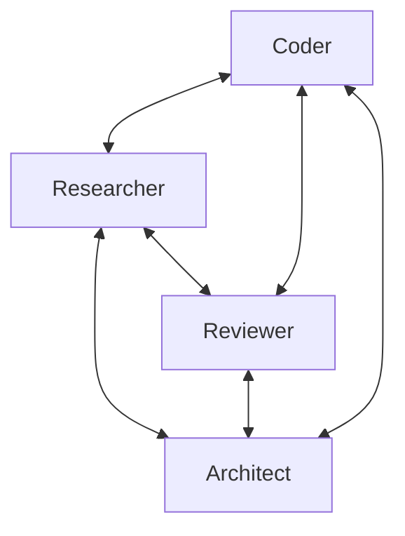

A Swarm is a collaborative agent orchestration system where multiple agents work together as a team to solve complex tasks. Unlike traditional sequential or hierarchical multi-agent systems, a Swarm enables autonomous coordination between agents with shared context and working memory.

-   **Self-organizing agent teams** with shared working memory
-   **Agent-driven coordination** through autonomous handoffs
-   **Autonomous agent collaboration** without central control
-   **Dynamic task distribution** based on agent capabilities
-   **Collective intelligence** through shared context
-   **Multi-modal input support** for handling text, images, and other content types

## How Swarms Work

Swarms operate on the principle of emergent intelligence - the idea that a group of specialized agents working together can solve problems more effectively than a single agent. Each agent in a Swarm:

1.  Has access to the full task context
2.  Can see the history of which agents have worked on the task
3.  Can access shared knowledge contributed by other agents
4.  Can decide when to hand off to another agent with different expertise



## Creating a Swarm

```sa-tabs
[
 {
  "label": "Python",
  "body": "To create a Swarm, you need to define a collection of agents with different specializations. By default, the first agent in the list will receive the initial user request, but you can specify any agent as the entry point using the `entry_point` parameter:\n\n```python\nimport logging\nfrom strands import Agent\nfrom strands.multiagent import Swarm\n\n# Enable debug logs and print them to stderr\nlogging.getLogger(\"strands.multiagent\").setLevel(logging.DEBUG)\nlogging.basicConfig(\n    format=\"%(levelname)s | %(name)s | %(message)s\",\n    handlers=[logging.StreamHandler()]\n)\n\n# Create specialized agents\nresearcher = Agent(name=\"researcher\", system_prompt=\"You are a research specialist...\")\ncoder = Agent(name=\"coder\", system_prompt=\"You are a coding specialist...\")\nreviewer = Agent(name=\"reviewer\", system_prompt=\"You are a code review specialist...\")\narchitect = Agent(name=\"architect\", system_prompt=\"You are a system architecture specialist...\")\n\n# Create a swarm with these agents, starting with the researcher\nswarm = Swarm(\n    [coder, researcher, reviewer, architect],\n    entry_point=researcher,  # Start with the researcher\n    max_handoffs=20,\n    max_iterations=20,\n    execution_timeout=900.0,  # 15 minutes\n    node_timeout=300.0,       # 5 minutes per agent\n    repetitive_handoff_detection_window=8,  # There must be >= 3 unique agents in the last 8 handoffs\n    repetitive_handoff_min_unique_agents=3\n)\n\n# Execute the swarm on a task\nresult = swarm(\"Design and implement a simple REST API for a todo app\")\n# Or use invoke_async for async execution: result = await swarm.invoke_async(...)\n\n# Access the final result\nprint(f\"Status: {result.status}\")\nprint(f\"Node history: {[node.node_id for node in result.node_history]}\")\n```"
 },
 {
  "label": "TypeScript",
  "body": "To create a Swarm, define a collection of agents with different specializations. By default, the first agent in `nodes` receives the initial input. Use `start` to override this. Agent `description` fields help the swarm make informed routing decisions:\n\n```typescript\nconst researcher = new Agent({\n  id: 'researcher',\n  description: 'Researches topics and gathers information.',\n  systemPrompt: 'You are a research specialist...',\n})\n\nconst architect = new Agent({\n  id: 'architect',\n  description: 'Designs system architecture based on research.',\n  systemPrompt: 'You are a system architecture specialist...',\n})\n\nconst coder = new Agent({\n  id: 'coder',\n  description: 'Implements code based on architecture designs.',\n  systemPrompt: 'You are a coding specialist...',\n})\n\nconst reviewer = new Agent({\n  id: 'reviewer',\n  description: 'Reviews code and provides the final result.',\n  systemPrompt: 'You are a code review specialist...',\n})\n\nconst swarm = new Swarm({\n  nodes: [researcher, architect, coder, reviewer],\n  start: 'researcher',\n  maxSteps: 10,\n})\n\n// Execute the swarm on a task\nconst result = await swarm.invoke(\n  'Design and implement a simple REST API for a todo app'\n)\n\n// Access the final result\nconsole.log('Status:', result.status)\nconsole.log('Node history:', result.results.map((r) => r.nodeId).join(' -> '))\n```"
 }
]
```

In this example:

1.  The `researcher` receives the initial request and might start by handing off to the `architect`
2.  The `architect` designs an API and system architecture
3.  Handoff to the `coder` to implement the API and architecture
4.  The `coder` writes the code
5.  Handoff to the `reviewer` for code review
6.  Finally, the `reviewer` provides the final result

## Swarm Configuration

The following initialization parameters control swarm behavior and safety limits:

```sa-tabs
[
 {
  "label": "Python",
  "body": "| Parameter | Description | Default |\n| --- | --- | --- |\n| `entry_point` | The agent instance to start with | None (uses first agent) |\n| `max_handoffs` | Maximum number of agent handoffs allowed | 20 |\n| `max_iterations` | Maximum total iterations across all agents | 20 |\n| `execution_timeout` | Total execution timeout in seconds | 900.0 (15 min) |\n| `node_timeout` | Individual agent timeout in seconds | 300.0 (5 min) |\n| `repetitive_handoff_detection_window` | Number of recent nodes to check for ping-pong behavior | 0 (disabled) |\n| `repetitive_handoff_min_unique_agents` | Minimum unique nodes required in recent sequence | 0 (disabled) |"
 },
 {
  "label": "TypeScript",
  "body": "| Parameter | Description | Default |\n| --- | --- | --- |\n| `start` | Agent ID that receives the initial input | First agent in `nodes` |\n| `nodes` | Array of agents (or `AgentNodeOptions`) | (required) |\n| `maxSteps` | Maximum total agent executions (including start) | Infinity |\n| `timeout` | Wall-clock ceiling for the entire swarm invocation, in milliseconds | Infinity |\n| `nodeTimeout` | Fallback per-node wall-clock ceiling in milliseconds. Applied to any node without its own `timeout` | Infinity |\n| `plugins` | Plugins for event-driven extensibility | None |\n\nTo bound an individual node, pass `timeout` on its `AgentNodeOptions` entry. Per-node `timeout` overrides the orchestrator\u2019s `nodeTimeout` and must be at least 1 ms.\n\nIf neither `maxSteps` nor `timeout` is set, the SDK emits a one-time warning at construction since a swarm with no bound can run indefinitely.\n\nTimeouts are enforced via `AbortSignal` and are cooperative. A tool that neither polls its cancel signal nor forwards it to a cancellable API can run past the deadline."
 }
]
```

## Multi-Modal Input Support

Swarms support multi-modal inputs like text and images using content blocks:

```sa-tabs
[
 {
  "label": "Python",
  "body": "```python\nfrom strands import Agent\nfrom strands.multiagent import Swarm\nfrom strands.types.content import ContentBlock\n\n# Create agents for image processing workflow\nimage_analyzer = Agent(name=\"image_analyzer\", system_prompt=\"You are an image analysis expert...\")\nreport_writer = Agent(name=\"report_writer\", system_prompt=\"You are a report writing expert...\")\n\n# Create the swarm\nswarm = Swarm([image_analyzer, report_writer])\n\n# Create content blocks with text and image\ncontent_blocks = [\n    ContentBlock(text=\"Analyze this image and create a report about what you see:\"),\n    ContentBlock(image={\"format\": \"png\", \"source\": {\"bytes\": image_bytes}}),\n]\n\n# Execute the swarm with multi-modal input\nresult = swarm(content_blocks)\n```"
 },
 {
  "label": "TypeScript",
  "body": "```typescript\n// Create agents for image processing workflow\nconst imageAnalyzer = new Agent({\n  id: 'image_analyzer',\n  description: 'Analyzes images and extracts key details.',\n  systemPrompt: 'You are an image analysis expert...',\n})\n\nconst reportWriter = new Agent({\n  id: 'report_writer',\n  description: 'Writes reports based on analysis.',\n  systemPrompt: 'You are a report writing expert...',\n})\n\n// Create the swarm\nconst swarm = new Swarm({\n  nodes: [imageAnalyzer, reportWriter],\n})\n\n// Create content blocks with text and image\nconst imageBytes = new Uint8Array(/* your image data */)\nconst contentBlocks = [\n  new TextBlock('Analyze this image and create a report about what you see:'),\n  new ImageBlock({ format: 'png', source: { bytes: imageBytes } }),\n]\n\n// Execute the swarm with multi-modal input\nconst result = await swarm.invoke(contentBlocks)\n```"
 }
]
```

## Swarm Coordination

```sa-tabs
[
 {
  "label": "Python",
  "body": "**Handoff Tool**\n\nWhen you create a Swarm in Python, each agent is automatically equipped with special tools for coordination. Agents can transfer control to another agent when they need specialized help:\n\n```python\n# Handoff Tool Description: Transfer control to another agent in the swarm for specialized help.\nhandoff_to_agent(\n    agent_name=\"coder\",\n    message=\"I need help implementing this algorithm in Python\",\n    context={\"algorithm_details\": \"...\"}\n)\n```\n\n**Shared Context**\n\nThe Swarm maintains a shared context that all agents can access. This includes:\n\n-   The original task description\n-   History of which agents have worked on the task\n-   Knowledge contributed by previous agents\n-   List of available agents for collaboration\n\nThe formatted context for each agent looks like:\n\n```plaintext\nHandoff Message: The user needs help with Python debugging - I've identified the issue but need someone with more expertise to fix it.\n\nUser Request: My Python script is throwing a KeyError when processing JSON data from an API\n\nPrevious agents who worked on this: data_analyst \u2192 code_reviewer\n\nShared knowledge from previous agents:\n\u2022 data_analyst: {\"issue_location\": \"line 42\", \"error_type\": \"missing key validation\", \"suggested_fix\": \"add key existence check\"}\n\u2022 code_reviewer: {\"code_quality\": \"good overall structure\", \"security_notes\": \"API key should be in environment variable\"}\n\nOther agents available for collaboration:\nAgent name: data_analyst. Agent description: Analyzes data and provides deeper insights\nAgent name: code_reviewer.\nAgent name: security_specialist. Agent description: Focuses on secure coding practices and vulnerability assessment\n\nYou have access to swarm coordination tools if you need help from other agents.\n```"
 },
 {
  "label": "TypeScript",
  "body": "**Structured Output Routing**\n\nAgents use structured output to decide the next step. Each agent\u2019s response includes:\n\n-   `agentId` \u2014 the agent to hand off to (omit to end the swarm and return a final response)\n-   `message` \u2014 instructions for the next agent, or the final response if no handoff\n-   `context` \u2014 optional structured data to pass along with the handoff\n\nAgent descriptions are used to help agents make informed routing decisions."
 }
]
```

## Shared State

Swarms support passing shared state to all agents. This enables sharing context and configuration across agents without exposing it to the LLM, keeping it separate from the shared context used for collaboration.

For detailed information about shared state, including examples and best practices, see [Shared State Across Multi-Agent Patterns](lc:user-guide/concepts/multi-agent/multi-agent-patterns#shared-state-across-multi-agent-patterns).

## Streaming Events

Swarms support real-time streaming of events during execution. This provides visibility into agent collaboration, handoffs, and autonomous coordination.

```sa-tabs
[
 {
  "label": "Python",
  "body": "```python\nfrom strands import Agent\nfrom strands.multiagent import Swarm\n\n# Create specialized agents\ncoordinator = Agent(name=\"coordinator\", system_prompt=\"You coordinate tasks...\")\nspecialist = Agent(name=\"specialist\", system_prompt=\"You handle specialized work...\")\n\n# Create swarm\nswarm = Swarm([coordinator, specialist])\n\n# Stream events during execution\nasync for event in swarm.stream_async(\"Design and implement a REST API\"):\n    # Track node execution\n    if event.get(\"type\") == \"multiagent_node_start\":\n        print(f\"\ud83d\udd04 Agent {event['node_id']} taking control\")\n\n    # Monitor agent events\n    elif event.get(\"type\") == \"multiagent_node_stream\":\n        inner_event = event[\"event\"]\n        if \"data\" in inner_event:\n            print(inner_event[\"data\"], end=\"\")\n\n    # Track handoffs\n    elif event.get(\"type\") == \"multiagent_handoff\":\n        from_nodes = \", \".join(event['from_node_ids'])\n        to_nodes = \", \".join(event['to_node_ids'])\n        print(f\"\\n\ud83d\udd00 Handoff: {from_nodes} \u2192 {to_nodes}\")\n\n    # Get final result\n    elif event.get(\"type\") == \"multiagent_result\":\n        result = event[\"result\"]\n        print(f\"\\nSwarm completed: {result.status}\")\n```"
 },
 {
  "label": "TypeScript",
  "body": "```typescript\nconst swarm = new Swarm({\n  nodes: [coordinator, specialist],\n  maxSteps: 4,\n})\n\nfor await (const event of swarm.stream('Design and implement a REST API')) {\n  switch (event.type) {\n    // Track handoffs between agents\n    case 'multiAgentHandoffEvent':\n      console.log(`\\n\ud83d\udd00 Handoff: ${event.source} -> ${event.targets.join(', ')}`)\n      break\n\n    // Monitor individual node results\n    case 'nodeResultEvent':\n      console.log(`\\n\u2705 Node ${event.result.nodeId}: ${event.result.status}`)\n      break\n\n    // Get final result\n    case 'multiAgentResultEvent':\n      console.log(`\\nSwarm completed: ${event.result.status}`)\n      break\n  }\n}\n```"
 }
]
```

See the [streaming overview](lc:user-guide/concepts/streaming#multi-agent-events) for details on all multi-agent event types.

## Swarm Results

When a Swarm completes execution, it returns a result object with detailed information:

```sa-tabs
[
 {
  "label": "Python",
  "body": "```python\nresult = swarm(\"Design a system architecture for...\")\n\n# Check execution status\nprint(f\"Status: {result.status}\")  # COMPLETED, FAILED, etc.\n\n# See which agents were involved\nfor node in result.node_history:\n    print(f\"Agent: {node.node_id}\")\n\n# Get results from specific nodes\nanalyst_result = result.results[\"analyst\"].result\nprint(f\"Analysis: {analyst_result}\")\n\n# Get performance metrics\nprint(f\"Total iterations: {result.execution_count}\")\nprint(f\"Execution time: {result.execution_time}ms\")\nprint(f\"Token usage: {result.accumulated_usage}\")\n```"
 },
 {
  "label": "TypeScript",
  "body": "```typescript\nconst swarm = new Swarm({\n  nodes: [researcher, writer],\n  maxSteps: 4,\n})\n\nconst result = await swarm.invoke('Design a system architecture for...')\n\n// Check execution status\nconsole.log('Status:', result.status)\n\n// See which agents were involved\nfor (const nodeResult of result.results) {\n  console.log(`Agent: ${nodeResult.nodeId}`)\n}\n\n// Get performance metrics\nconsole.log('Duration:', result.duration, 'ms')\n\n// Get the final output\nconsole.log('Output:', result.content.find((b) => b.type === 'textBlock')?.text)\n```"
 }
]
```

## Swarm as a Tool

> [!NOTE] Python only
>
> The `swarm` tool from `strands-agents-tools` is currently only available in Python.

Agents can dynamically create and orchestrate swarms by using the `swarm` tool available in the [Strands tools package](lc:user-guide/concepts/tools/community-tools-package).

```python
from strands import Agent
from strands_tools import swarm

agent = Agent(tools=[swarm], system_prompt="Create a swarm of agents to solve the user's query.")

agent("Research, analyze, and summarize the latest advancements in quantum computing")
```

In this example:

1.  The agent uses the `swarm` tool to dynamically create a team of specialized agents. These might include a researcher, an analyst, and a technical writer
2.  Next the agent executes the swarm
3.  The swarm agents collaborate autonomously, handing off to each other as needed
4.  The agent analyzes the swarm results and provides a comprehensive response to the user

## Safety Mechanisms

Swarms include several safety mechanisms to prevent infinite loops and ensure reliable execution:

1.  **Step limits**: Caps the total number of agent executions to prevent runaway loops
2.  **Execution timeout**: Sets a maximum total runtime for the Swarm
3.  **Node timeout**: Limits how long any single agent can run
4.  **Repetitive handoff detection**: Prevents agents from endlessly passing control back and forth

The specific parameters and their defaults vary by SDK. See the [Swarm Configuration](#swarm-configuration) table for details.

## Best Practices

1.  **Create specialized agents**: Define clear roles for each agent in your Swarm
2.  **Use descriptive agent names**: Names should reflect the agent’s specialty
3.  **Set appropriate timeouts**: Adjust based on task complexity and expected runtime
4.  **Enable repetitive handoff detection**: Configure detection parameters to prevent ping-pong behavior between agents
5.  **Include diverse expertise**: Ensure your Swarm has agents with complementary skills
6.  **Provide agent descriptions**: Add descriptions to your agents to help other agents understand their capabilities
7.  **Leverage multi-modal inputs**: Use ContentBlocks for rich inputs including images

## SDK Differences

The Swarm pattern is available in multiple SDKs. While the core concept is the same, there are behavioral differences.

**Handoff mechanism**: Python injects a `handoff_to_agent` tool that agents call to trigger handoffs. TypeScript uses a structured output schema (`{ agentId, message, context }`), meaning every agent’s response is shaped by this schema. When `agentId` is present, the orchestrator hands off to that agent with `message` as input. When omitted, `message` becomes the final swarm response. The final agent’s output is always shaped by the schema, though agents can still produce side effects (tool calls, API calls) during their turn.

**Shared context**: Python maintains a mutable `SharedContext` that accumulates key-value pairs across agents, where each agent can read and write to it. TypeScript passes context as a serialized JSON text block in the handoff input to the next agent, avoiding cross-agent mutable state.

**Step limits**: Python uses separate `max_handoffs` and `max_iterations` limits. TypeScript uses a single `maxSteps` that counts total agent executions including the start agent.

**Node input**: Python builds a rich context string for each receiving agent that includes the original task, full node history chain, accumulated shared context, and available agent descriptions. TypeScript passes only the handoff message and serialized context from the handing-off agent. Agent descriptions are already embedded in the structured output schema for routing decisions.

**Error handling**: In both SDKs, node failures produce a FAILED result. Orchestrator-level limit violations (e.g., exceeding `maxSteps`) throw an exception in TypeScript to promote fail-fast behavior for global failures. Python returns a FAILED result instead.

**Node cancellation**: Both SDKs support cancelling a node before execution via hook callbacks. In TypeScript, a cancelled node produces a CANCELLED result status, allowing the orchestrator to distinguish cancellation from failure. In Python, a cancelled node results in a FAILED status.

## Related pages

- [Agent Workflows: Building Multi-Agent Systems with Strands Agents SDK](lc:user-guide/concepts/multi-agent/workflow) (1 shared tag)
- [Agent-to-Agent (A2A) Protocol](lc:user-guide/concepts/multi-agent/agent-to-agent) (1 shared tag)
- [Graph Multi-Agent Pattern](lc:user-guide/concepts/multi-agent/graph) (1 shared tag)
- [Multi-agent Patterns](lc:user-guide/concepts/multi-agent/multi-agent-patterns) (1 shared tag)
- [Agents as Tools with Strands Agents SDK](lc:user-guide/concepts/multi-agent/agents-as-tools) (1 shared tag)


## Implementation

### Python

- [harness-sdk/strands-py/src/strands/multiagent/base.py](https://github.com/strands-agents/harness-sdk/blob/main/strands-py/src/strands/multiagent/base.py)
- [harness-sdk/strands-py/src/strands/multiagent/swarm.py](https://github.com/strands-agents/harness-sdk/blob/main/strands-py/src/strands/multiagent/swarm.py)

### TypeScript

- [harness-sdk/strands-ts/src/multiagent/swarm.ts](https://github.com/strands-agents/harness-sdk/blob/main/strands-ts/src/multiagent/swarm.ts)
