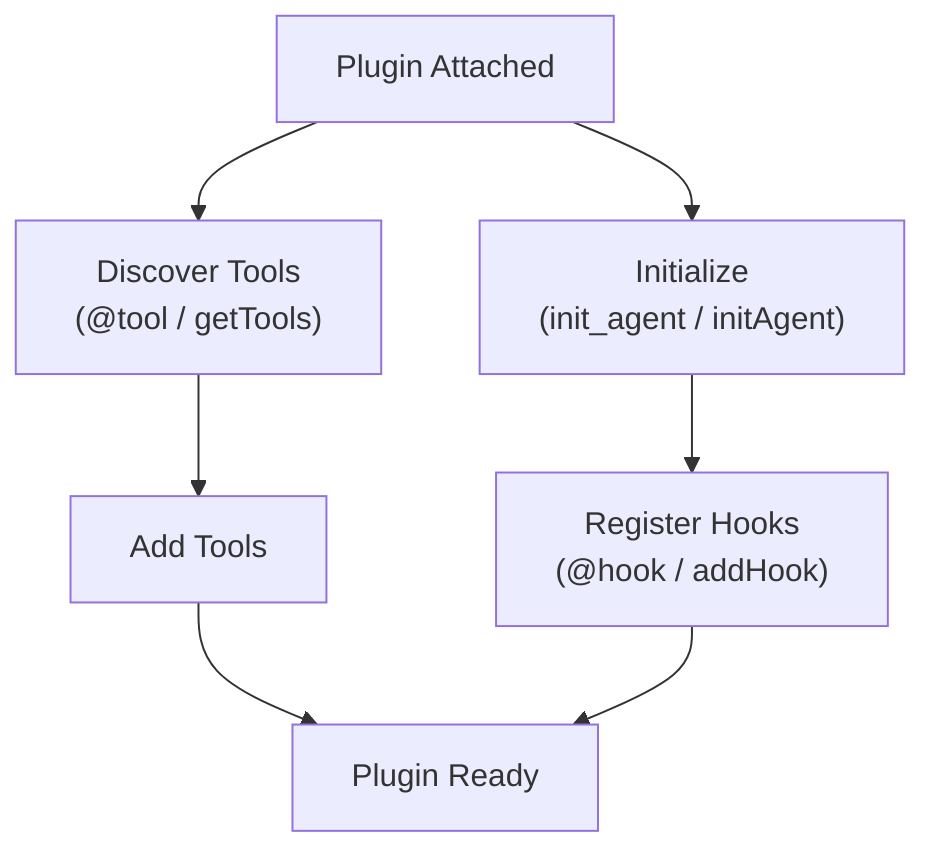

Plugins allow you to change the typical behavior of an agent. They enable you to introduce concepts like [Skills](https://agentskills.io/specification), [steering](lc:user-guide/concepts/plugins/steering), or other behavioral modifications into the agentic loop. Plugins work by taking advantage of the low-level primitives exposed by the Agent class—`model`, `system_prompt``systemPrompt`, `messages`, `tools`, and `hooks`—and executing logic to improve an agent’s behavior.

The Strands SDK provides built-in plugins that you can use out of the box:

-   **[Skills](lc:user-guide/concepts/plugins/skills)** - On-demand, modular instructions that agents discover and activate at runtime following the [Agent Skills specification](https://agentskills.io/specification)
-   **[Steering](lc:user-guide/concepts/plugins/steering)** - Modular prompting for complex agent tasks through context-aware guidance
-   **[Context Offloader](lc:user-guide/concepts/plugins/context-offloader)** - Proactively offloads oversized tool results to storage, replacing them with previews and providing a built-in retrieval tool
-   **[Context Injector](lc:user-guide/concepts/plugins/context-injector)** - Folds real-time text (a clock, environment facts, a lookup) into the model input before each call, without persisting it to history

You can also build and distribute your own plugins to extend agent functionality. See [Get Featured](lc:community/get-featured) to share your plugins with the community.

## Using Plugins

Plugins are passed to agents during initialization via the `plugins` parameter:

```sa-tabs
[
 {
  "label": "Python",
  "body": "```python\nfrom strands import Agent\nfrom strands.vended_plugins.steering import LLMSteeringHandler\n\n# Create an agent with plugins\nagent = Agent(\n    tools=[my_tool],\n    plugins=[LLMSteeringHandler(system_prompt=\"Guide the agent...\")]\n)\n```"
 },
 {
  "label": "TypeScript",
  "body": "```typescript\nimport { Agent, Plugin, Tool } from '@strands-agents/sdk'\n\n// Create an agent with plugins\nconst agent = new Agent({\n  tools: [myTool],\n  plugins: [new GuidancePlugin('Guide the agent...')],\n})\n```"
 }
]
```

## Building Plugins

This section walks through how to build a custom plugin step by step.

### Basic Plugin Structure

A plugin is a class that extends the `Plugin` base class and defines a `name` property. For example, a simple logging plugin would look like this:

```sa-tabs
[
 {
  "label": "Python",
  "body": "```python\nfrom strands import Agent, tool\nfrom strands.plugins import Plugin, hook\nfrom strands.hooks import BeforeToolCallEvent, AfterToolCallEvent\n\nclass LoggingPlugin(Plugin):\n    \"\"\"A plugin that logs all tool calls and provides a utility tool.\"\"\"\n\n    name = \"logging-plugin\"\n\n    @hook\n    def log_before_tool(self, event: BeforeToolCallEvent) -> None:\n        \"\"\"Called before each tool execution.\"\"\"\n        print(f\"[LOG] Calling tool: {event.tool_use['name']}\")\n        print(f\"[LOG] Input: {event.tool_use['input']}\")\n\n    @hook\n    def log_after_tool(self, event: AfterToolCallEvent) -> None:\n        \"\"\"Called after each tool execution.\"\"\"\n        print(f\"[LOG] Tool completed: {event.tool_use['name']}\")\n\n    @tool\n    def debug_print(self, message: str) -> str:\n        \"\"\"Print a debug message.\n\n        Args:\n            message: The message to print\n        \"\"\"\n        print(f\"[DEBUG] {message}\")\n        return f\"Printed: {message}\"\n\n# Using the plugin\nagent = Agent(plugins=[LoggingPlugin()])\nagent(\"Calculate 2 + 2 and print the result\")\n```"
 },
 {
  "label": "TypeScript",
  "body": "```typescript\nimport { Agent, FunctionTool, Plugin, Tool } from '@strands-agents/sdk'\nimport { BeforeToolCallEvent, AfterToolCallEvent } from '@strands-agents/sdk'\n\nclass LoggingPlugin implements Plugin {\n  name = 'logging-plugin'\n\n  initAgent(agent: LocalAgent): void {\n    // Register hooks manually in initAgent\n    agent.addHook(BeforeToolCallEvent, (event) => {\n      console.log(`[LOG] Calling tool: ${event.toolUse.name}`)\n      console.log(`[LOG] Input: ${JSON.stringify(event.toolUse.input)}`)\n    })\n\n    agent.addHook(AfterToolCallEvent, (event) => {\n      console.log(`[LOG] Tool completed: ${event.toolUse.name}`)\n    })\n  }\n\n  getTools(): Tool[] {\n    // Provide additional tools via the plugin\n    return [debugPrintTool]\n  }\n}\n\n// Using the plugin\nconst agent = new Agent({\n  plugins: [new LoggingPlugin()],\n})\n\n// Custom tool to add\nconst debugPrintTool = new FunctionTool({\n  name: 'debug_print',\n  description: 'Print a debug message',\n  inputSchema: {\n    type: 'object',\n    properties: {\n      message: { type: 'string', description: 'The message to print' },\n    },\n    required: ['message'],\n  },\n  callback: async (input: unknown) => {\n    const typedInput = input as { message: string }\n    console.log(`[DEBUG] ${typedInput.message}`)\n    return `Printed: ${typedInput.message}`\n  },\n})\n```"
 }
]
```

### How It Works Under the Hood

When you attach a plugin to an agent, the following happens:

```sa-tabs
[
 {
  "label": "Python",
  "body": "1.  **Discovery**: The `Plugin` base class scans for methods decorated with `@hook` and `@tool`\n2.  **Hook Registration**: Each `@hook` method is registered with the agent\u2019s hook registry based on its event type hint\n3.  **Tool Registration**: Each `@tool` method is added to the agent\u2019s tools list\n4.  **Initialization**: The `init_agent(agent)` method is called for any custom setup"
 },
 {
  "label": "TypeScript",
  "body": "1.  **Tool Registration**: The `getTools()` method is called to get tools provided by the plugin\n2.  **Initialization**: The `initAgent(agent)` method is called for hook registration and setup\n3.  **Hook Registration**: In `initAgent`, use `agent.addHook()` to register event callbacks manually\n\n**Note**: TypeScript does not use `@hook` or `@tool` decorators. Instead, tools are returned from `getTools()` and hooks are registered manually in `initAgent()`."
 }
]
```



### Registering Hooks in Plugins

```sa-tabs
[
 {
  "label": "Python",
  "body": "#### The `@hook` Decorator\n\nThe `@hook` decorator marks methods as hook callbacks. The event type is automatically inferred from the type hint:\n\n```python\nfrom strands.plugins import Plugin, hook\nfrom strands.hooks import BeforeModelCallEvent, AfterModelCallEvent\n\nclass ModelMonitorPlugin(Plugin):\n    name = \"model-monitor\"\n\n    @hook\n    def before_model(self, event: BeforeModelCallEvent) -> None:\n        \"\"\"Event type inferred from type hint.\"\"\"\n        print(\"Model call starting...\")\n\n    @hook\n    def on_model_event(self, event: BeforeModelCallEvent | AfterModelCallEvent) -> None:\n        \"\"\"Handle multiple event types with a union.\"\"\"\n        print(f\"Model event: {type(event).__name__}\")\n```"
 },
 {
  "label": "TypeScript",
  "body": "#### Manual Hook Registration\n\nTypeScript plugins register hooks manually in the `initAgent` method using `agent.addHook()`:\n\n```typescript\nimport { Plugin } from '@strands-agents/sdk'\nimport { BeforeModelCallEvent, AfterModelCallEvent } from '@strands-agents/sdk'\n\nclass ModelMonitorPlugin implements Plugin {\n  name = 'model-monitor'\n\n  initAgent(agent: LocalAgent): void {\n    // Register a hook for a single event type\n    agent.addHook(BeforeModelCallEvent, () => {\n      console.log('Model call starting...')\n    })\n\n    // Register the same handler for multiple event types (union equivalent)\n    const onModelEvent = (event: BeforeModelCallEvent | AfterModelCallEvent) => {\n      console.log(`Model event: ${event.constructor.name}`)\n    }\n    agent.addHook(BeforeModelCallEvent, onModelEvent)\n    agent.addHook(AfterModelCallEvent, onModelEvent)\n  }\n}\n```"
 }
]
```

### Manual Hook and Tool Registration

For more control, you can manually register hooks and tools in the `init_agent``initAgent` method:

```sa-tabs
[
 {
  "label": "Python",
  "body": "```python\nfrom strands.plugins import Plugin\nfrom strands.hooks import BeforeToolCallEvent\n\nclass ManualPlugin(Plugin):\n    name = \"manual-plugin\"\n\n    def __init__(self, verbose: bool = False):\n        super().__init__()\n        self.verbose = verbose\n\n    def init_agent(self, agent: \"Agent\") -> None:\n        # Conditionally register additional hooks\n        if self.verbose:\n            agent.add_hook(self.verbose_log, BeforeToolCallEvent)\n\n        # Access agent properties\n        print(f\"Attached to agent with {len(agent.tool_names)} tools\")\n\n    def verbose_log(self, event: BeforeToolCallEvent) -> None:\n        print(f\"[VERBOSE] {event.tool_use}\")\n```"
 },
 {
  "label": "TypeScript",
  "body": "```typescript\nimport { Plugin } from '@strands-agents/sdk'\nimport { BeforeToolCallEvent } from '@strands-agents/sdk'\n\nclass ManualPlugin implements Plugin {\n  private verbose: boolean\n\n  name = 'manual-plugin'\n\n  constructor(options: { verbose?: boolean } = {}) {\n    this.verbose = options.verbose ?? false\n  }\n\n  initAgent(agent: LocalAgent): void {\n    // Conditionally register additional hooks\n    if (this.verbose) {\n      agent.addHook(BeforeToolCallEvent, (event) => {\n        console.log(`[VERBOSE] ${JSON.stringify(event.toolUse)}`)\n      })\n    }\n\n    // Access agent tools via toolRegistry\n    console.log(`Attached to agent with ${agent.toolRegistry.list().length} tools`)\n  }\n}\n```"
 }
]
```

### Managing Plugin State

Plugins can maintain state that persists across agent invocations. For state that needs to be serialized or shared, use the [Agent State](lc:user-guide/concepts/agents/state) mechanism:

```sa-tabs
[
 {
  "label": "Python",
  "body": "```python\nfrom strands import Agent\nfrom strands.plugins import Plugin, hook\nfrom strands.hooks import BeforeToolCallEvent, AfterToolCallEvent\n\nclass MetricsPlugin(Plugin):\n    \"\"\"Track tool execution metrics using agent state.\"\"\"\n\n    name = \"metrics-plugin\"\n\n    def init_agent(self, agent: \"Agent\") -> None:\n        # Initialize state values if not present\n        if \"metrics_call_count\" not in agent.state:\n            agent.state.set(\"metrics_call_count\", 0)\n\n    @hook\n    def count_calls(self, event: BeforeToolCallEvent) -> None:\n        current = event.agent.state.get(\"metrics_call_count\", 0)\n        event.agent.state.set(\"metrics_call_count\", current + 1)\n\n# Usage\nagent = Agent(plugins=[MetricsPlugin()])\nagent(\"Do some work\")\nprint(f\"Tool calls: {agent.state.get('metrics_call_count')}\")\n```"
 },
 {
  "label": "TypeScript",
  "body": "```typescript\nimport { Agent, Plugin } from '@strands-agents/sdk'\nimport { BeforeToolCallEvent } from '@strands-agents/sdk'\n\nclass MetricsPlugin implements Plugin {\n  name = 'metrics-plugin'\n\n  initAgent(agent: LocalAgent): void {\n    // Initialize state values if not present\n    if (!agent.appState.get('metrics_call_count')) {\n      agent.appState.set('metrics_call_count', 0)\n    }\n\n    agent.addHook(BeforeToolCallEvent, () => {\n      const current = (agent.appState.get('metrics_call_count') as number) ?? 0\n      agent.appState.set('metrics_call_count', current + 1)\n    })\n  }\n}\n\n// Usage\nconst metricsPlugin = new MetricsPlugin()\nconst agent = new Agent({\n  plugins: [metricsPlugin],\n})\nconsole.log(`Tool calls: ${agent.appState.get('metrics_call_count')}`)\n```"
 }
]
```

See [Agent State](lc:user-guide/concepts/agents/state) for more information on state management.

### Async Plugin Initialization

Plugins can perform asynchronous initialization:

```sa-tabs
[
 {
  "label": "Python",
  "body": "```python\nimport asyncio\nfrom strands.plugins import Plugin, hook\nfrom strands.hooks import BeforeToolCallEvent\n\nclass AsyncConfigPlugin(Plugin):\n    name = \"async-config\"\n\n    async def init_agent(self, agent: \"Agent\") -> None:\n        # Async initialization\n        self.config = await self.load_config()\n\n    async def load_config(self) -> dict:\n        await asyncio.sleep(0.1)  # Simulate async operation\n        return {\"setting\": \"value\"}\n\n    @hook\n    def use_config(self, event: BeforeToolCallEvent) -> None:\n        print(f\"Config: {self.config}\")\n```"
 },
 {
  "label": "TypeScript",
  "body": "```typescript\nimport { Plugin } from '@strands-agents/sdk'\nimport { BeforeToolCallEvent } from '@strands-agents/sdk'\n\nclass AsyncConfigPlugin implements Plugin {\n  private config: Record<string, unknown> = {}\n\n  name = 'async-config'\n\n  async initAgent(agent: LocalAgent): Promise<void> {\n    // Async initialization\n    this.config = await this.loadConfig()\n\n    agent.addHook(BeforeToolCallEvent, () => {\n      console.log(`Config: ${JSON.stringify(this.config)}`)\n    })\n  }\n\n  private async loadConfig(): Promise<Record<string, unknown>> {\n    await new Promise((resolve) => setTimeout(resolve, 100)) // Simulate async operation\n    return { setting: 'value' }\n  }\n}\n```"
 }
]
```

## Next Steps

-   [Hooks](lc:user-guide/concepts/agents/hooks) - Learn about the underlying hook system
-   [Steering](lc:user-guide/concepts/plugins/steering) - Explore the built-in steering plugin
-   [Context Offloader](lc:user-guide/concepts/plugins/context-offloader) - Manage large tool results proactively
-   [Context Injector](lc:user-guide/concepts/plugins/context-injector) - Inject real-time context into the model input
-   [Get Featured](lc:community/get-featured) - Share your plugins with the community

## Related pages

- [Agent Loop](lc:user-guide/concepts/agents/agent-loop) (2 shared tags)
- [Hooks](lc:user-guide/concepts/agents/hooks) (2 shared tags)
- [Steering (Interventions)](lc:user-guide/concepts/agents/interventions/steering) (2 shared tags)
- [GoalLoop](lc:user-guide/concepts/plugins/goal-loop) (2 shared tags)
- [Interrupts](lc:user-guide/concepts/interrupts) (2 shared tags)
- [Interventions](lc:user-guide/concepts/agents/interventions) (2 shared tags)
- [Tool Executors](lc:user-guide/concepts/tools/executors) (1 shared tag)
- [Retry Strategies](lc:user-guide/concepts/agents/retry-strategies) (1 shared tag)
- [Bidirectional Streaming Hooks](lc:user-guide/concepts/bidirectional-streaming/hooks) (1 shared tag)
- [Steering (Plugins)](lc:user-guide/concepts/plugins/steering) (1 shared tag)


## Implementation

### Python

- [harness-sdk/strands-py/src/strands/plugins/plugin.py](https://github.com/strands-agents/harness-sdk/blob/main/strands-py/src/strands/plugins/plugin.py)

### TypeScript

- [harness-sdk/strands-ts/src/plugins/plugin.ts](https://github.com/strands-agents/harness-sdk/blob/main/strands-ts/src/plugins/plugin.ts)
