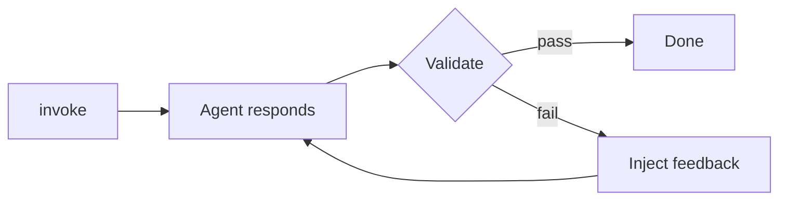

When your agent’s response needs to meet a quality bar before returning, `GoalLoop` handles the retry loop. It validates the response after each invocation, feeds feedback back as a user message on failure, and re-invokes the agent. This continues until validation passes, a max attempt count is reached, or a timeout elapses.

## The Problem

A single-pass agent response often misses the mark: too verbose, wrong format, incomplete reasoning, or failing a test suite. You could wrap the agent call in a manual retry loop, but that means reimplementing timeout logic, attempt tracking, feedback injection, and state management every time.

GoalLoop handles all of that as a plugin. Define what “done” means, attach it to your agent, and the retry loop runs automatically inside the existing hook lifecycle.

## How It Works



1.  The agent processes the prompt and produces a response.
2.  GoalLoop extracts the last assistant message and runs the validator.
3.  If the validator passes, the loop terminates with a “satisfied” result.
4.  If the validator fails and budget remains, GoalLoop injects feedback as a new user message and re-invokes the agent.
5.  If the attempt limit or timeout is exhausted, the loop terminates without retrying.

## Getting Started

Pass a natural-language goal string. GoalLoop builds an internal judge agent (using the host agent’s model) that grades each response against the goal and returns structured feedback on failure.

```sa-tabs
[
 {
  "label": "Python",
  "body": "```python\nfrom strands import Agent\nfrom strands.vended_plugins.goal import GoalLoop\n\nconcise = GoalLoop(\n    goal=\"At most 3 sentences, accessible to a 10-year-old, \"\n         \"no jargon.\",\n    max_attempts=3,\n)\n\nagent = Agent(plugins=[concise])\nresult = agent(\"Explain how rainbows form.\")\nprint(concise.last_result(agent))\n\n# Typical output:\n# GoalResult(passed=True, stop_reason='satisfied', attempts=[...])\n```"
 },
 {
  "label": "TypeScript",
  "body": "```typescript\nimport { Agent } from '@strands-agents/sdk'\nimport { GoalLoop } from '@strands-agents/sdk/vended-plugins/goal'\n\nconst concise = new GoalLoop({\n  goal: 'At most 3 sentences, accessible to a 10-year-old, '\n    + 'no jargon.',\n  maxAttempts: 3,\n})\n\nconst agent = new Agent({ plugins: [concise] })\nawait agent.invoke('Explain how rainbows form.')\nconsole.log(concise.lastResult(agent))\n\n// Typical output:\n// { passed: true, stopReason: 'satisfied', attempts: [...] }\n```"
 }
]
```

## Programmatic Validators

For checks that don’t need a language model (word count, schema conformance, test suite exit codes), pass a function as `goal`. This skips the judge agent entirely.

A validator receives the last assistant message and the host agent. It returns:

-   `true` / `false` (shorthand: pass or fail with no feedback)
-   A dict/object with `passed` and optional `feedback`
-   A `ValidationOutcome` instance

```sa-tabs
[
 {
  "label": "Python",
  "body": "```python\nfrom strands.vended_plugins.goal import GoalLoop\n\ndef word_count_validator(response, agent):\n    text = \" \".join(\n        block[\"text\"]\n        for block in response[\"content\"]\n        if \"text\" in block\n    )\n    words = len(text.split())\n    if words <= 50:\n        return True\n    return {\n        \"passed\": False,\n        \"feedback\": f\"Too long ({words} words). Cap at 50.\",\n    }\n\nplugin = GoalLoop(\n    goal=word_count_validator,\n    max_attempts=5,\n    timeout=30.0,\n)\n```"
 },
 {
  "label": "TypeScript",
  "body": "```typescript\nimport { Message } from '@strands-agents/sdk'\nimport { GoalLoop } from '@strands-agents/sdk/vended-plugins/goal'\n\nfunction wordCountValidator(response: Message) {\n  const text = response.content\n    .flatMap((b) => (b.type === 'textBlock' ? [b.text] : []))\n    .join(' ')\n  const words = text.trim().split(/\\s+/).length\n  if (words <= 50) return true\n  return { passed: false, feedback: `Too long (${words} words). Cap at 50.` }\n}\n\nconst plugin = new GoalLoop({\n  goal: wordCountValidator,\n  maxAttempts: 5,\n  timeout: 30_000,\n})\n```"
 }
]
```

Async validators work too. Run a test suite, call an external API, or await any I/O inside the validator:

```sa-tabs
[
 {
  "label": "Python",
  "body": "```python\nimport asyncio\nfrom strands.vended_plugins.goal import GoalLoop\n\nasync def tests_pass(response, agent):\n    proc = await asyncio.create_subprocess_exec(\n        \"pytest\", \"--tb=short\",\n        stdout=asyncio.subprocess.PIPE,\n        stderr=asyncio.subprocess.PIPE,\n    )\n    stdout, stderr = await proc.communicate()\n    if proc.returncode == 0:\n        return True\n    output = (stdout.decode() + stderr.decode())[-4000:]\n    return {\n        \"passed\": False,\n        \"feedback\": f\"pytest exited {proc.returncode}.\\n{output}\",\n    }\n\nplugin = GoalLoop(goal=tests_pass, max_attempts=10)\n```"
 },
 {
  "label": "TypeScript",
  "body": "```typescript\nimport { exec } from 'node:child_process'\nimport { promisify } from 'node:util'\nimport { GoalLoop } from '@strands-agents/sdk/vended-plugins/goal'\n\nconst plugin = new GoalLoop({\n  goal: async () => {\n    try {\n      await execAsync('npm test')\n      return true\n    } catch (err) {\n      const e = err as {\n        stdout?: string\n        stderr?: string\n      }\n      const out =\n        `${e.stdout ?? ''}${e.stderr ?? ''}`.slice(-4000)\n      return {\n        passed: false,\n        feedback: `Tests failed.\\n${out}`,\n      }\n    }\n  },\n  maxAttempts: 10,\n})\n```"
 }
]
```

## Configuration Reference

```sa-tabs
[
 {
  "label": "Python",
  "body": "| Parameter | Default | Description |\n| --- | --- | --- |\n| `goal` | *(required)* | Natural-language string (judged by internal agent) or callable validator |\n| `max_attempts` | `inf` | Maximum attempts before stopping |\n| `timeout` | `inf` | Wall-clock budget in **seconds** for the entire run |\n| `judge` | `None` | `JudgeConfig` with optional `model` and `system_prompt` for the NL judge |\n| `preserve_context` | `True` | Keep conversation history across retries |\n| `resume_prompt_template` | *(built-in)* | `Callable[[str | None], str | list[ContentBlock]]` that builds the retry message |\n| `name` | `\"strands:goal-loop\"` | Plugin name (must be unique per agent) |"
 },
 {
  "label": "TypeScript",
  "body": "| Parameter | Default | Description |\n| --- | --- | --- |\n| `goal` | *(required)* | Natural-language string (judged by internal agent) or `Validator` function |\n| `maxAttempts` | `Infinity` | Maximum attempts before stopping |\n| `timeout` | `Infinity` | Wall-clock budget in **milliseconds** for the entire run |\n| `judge` | `undefined` | `JudgeConfig` with optional `model` and `systemPrompt` for the NL judge |\n| `preserveContext` | `true` | Keep conversation history across retries |\n| `resumePromptTemplate` | *(built-in)* | `(feedback: string | undefined) => string | ContentBlock[]` that builds the retry message |\n| `name` | `\"strands:goal-loop\"` | Plugin name (must be unique per agent) |"
 }
]
```

When both the attempt limit and timeout are left unbounded (the defaults), the plugin warns at construction time. Set at least one bound in production to prevent runaway loops.

## Advanced Usage

### Inspecting Results

After an invocation completes, retrieve the result from the plugin to get the full attempt history:

```sa-tabs
[
 {
  "label": "Python",
  "body": "```python\nresult = plugin.last_result(agent)\nif result and not result.passed:\n    print(f\"Stopped after {len(result.attempts)} attempts\")\n    print(f\"Reason: {result.stop_reason}\")\n    for attempt in result.attempts:\n        print(f\"  #{attempt.attempt}: {attempt.feedback}\")\n```"
 },
 {
  "label": "TypeScript",
  "body": "```typescript\nconst result = plugin.lastResult(agent)\nif (result && !result.passed) {\n  console.log(\n    `Stopped after ${result.attempts.length} attempts`\n  )\n  console.log(`Reason: ${result.stopReason}`)\n  for (const attempt of result.attempts) {\n    console.log(`  #${attempt.attempt}: ${attempt.feedback}`)\n  }\n}\n```"
 }
]
```

The result is `None``undefined` before the first completed run and while a run is in-flight. It resets at the start of each new invocation.

### Stateless Retries

By default, the agent sees its own prior attempts and the validator’s feedback, letting it build on previous work. Disable context preservation to restore the agent’s full session state (messages, system prompt, model state) to the snapshot captured immediately before the first model call. Each retry starts fresh, seeing only the original input plus the latest feedback. Use this when prior attempts would confuse the model rather than help it.

```sa-tabs
[
 {
  "label": "Python",
  "body": "```python\nplugin = GoalLoop(\n    goal=tests_pass,\n    max_attempts=10,\n    preserve_context=False,\n)\n```"
 },
 {
  "label": "TypeScript",
  "body": "```typescript\nconst plugin = new GoalLoop({\n  goal: testsPass,\n  maxAttempts: 10,\n  preserveContext: false,\n})\n```"
 }
]
```

The snapshot excludes agent state (`state``appState`) deliberately — other plugins (rate limiters, cost trackers) rely on their mutations persisting across attempts.

### Custom Judge Configuration

When `goal` is a string, GoalLoop builds a judge agent from the host agent’s model. Override the model or system prompt to tune cost and behavior:

```sa-tabs
[
 {
  "label": "Python",
  "body": "```python\nfrom strands.models.bedrock import BedrockModel\nfrom strands.vended_plugins.goal import GoalLoop, JudgeConfig\n\nplugin = GoalLoop(\n    goal=\"Response must cite at least two sources.\",\n    max_attempts=3,\n    judge=JudgeConfig(\n        model=BedrockModel(model_id=\"us.amazon.nova-lite-v1:0\"),\n    ),\n)\n```"
 },
 {
  "label": "TypeScript",
  "body": "```typescript\nimport { BedrockModel } from '@strands-agents/sdk'\nimport { GoalLoop } from '@strands-agents/sdk/vended-plugins/goal'\n\nconst plugin = new GoalLoop({\n  goal: 'Response must cite at least two sources.',\n  maxAttempts: 3,\n  judge: {\n    model: new BedrockModel({\n      modelId: 'us.amazon.nova-lite-v1:0',\n    }),\n  },\n})\n```"
 }
]
```

### Custom Resume Prompt

Override how feedback is injected before each retry. The template receives the trimmed feedback string (or `None``undefined` when the validator gave none) and returns the user message content:

```sa-tabs
[
 {
  "label": "Python",
  "body": "```python\ndef start_over_prompt(feedback):\n    if not feedback:\n        return \"That didn't pass. Start over from scratch with a different approach.\"\n    return (\n        f\"Validation failed:\\n{feedback}\\n\\n\"\n        \"Do NOT edit your previous response. Start over from scratch \"\n        \"and take a completely different approach.\"\n    )\n\nplugin = GoalLoop(\n    goal=\"...\",\n    max_attempts=3,\n    resume_prompt_template=start_over_prompt,\n)\n```"
 },
 {
  "label": "TypeScript",
  "body": "```typescript\nconst plugin = new GoalLoop({\n  goal: '...',\n  maxAttempts: 3,\n  resumePromptTemplate: (feedback) => {\n    if (!feedback) {\n      return 'That didn\\'t pass. Start over from scratch '\n        + 'with a different approach.'\n    }\n    return `Validation failed:\\n${feedback}\\n\\n`\n      + 'Do NOT edit your previous response. Start over '\n      + 'from scratch and take a completely different approach.'\n  },\n})\n```"
 }
]
```

### Building a Custom Judge

The judge primitives are exported for use in function validators. Build your own judge with a custom model or prompt while reusing the same transcript format:

```sa-tabs
[
 {
  "label": "Python",
  "body": "```python\nfrom strands.vended_plugins.goal import (\n    GoalLoop,\n    build_judge_prompt,\n    JUDGE_SYSTEM_PROMPT,\n    JudgeOutcome,\n)\n\nasync def custom_judge(response, agent):\n    from strands import Agent as JudgeAgent\n    from strands.models.bedrock import BedrockModel\n\n    judge = JudgeAgent(\n        model=BedrockModel(model_id=\"us.amazon.nova-lite-v1:0\"),\n        callback_handler=None,\n        system_prompt=JUDGE_SYSTEM_PROMPT,\n        structured_output_model=JudgeOutcome,\n    )\n    prompt = build_judge_prompt(\"Be concise.\", agent.messages)\n    result = await judge.invoke_async(prompt)\n    outcome = result.structured_output\n    return {\"passed\": outcome.passed, \"feedback\": outcome.feedback}\n\nplugin = GoalLoop(goal=custom_judge, max_attempts=3)\n```"
 },
 {
  "label": "TypeScript",
  "body": "```typescript\nimport { Agent } from '@strands-agents/sdk'\nimport {\n  GoalLoop,\n  ValidationOutcome,\n  buildJudgePrompt,\n  JUDGE_SYSTEM_PROMPT,\n  JUDGE_OUTCOME_SCHEMA,\n} from '@strands-agents/sdk/vended-plugins/goal'\n\nconst plugin = new GoalLoop({\n  goal: async (_response, agent): Promise<ValidationOutcome> => {\n    const judge = new Agent({\n      printer: false,\n      systemPrompt: JUDGE_SYSTEM_PROMPT,\n    })\n    const result = await judge.invoke(\n      buildJudgePrompt('Be concise.', agent.messages),\n      { structuredOutputSchema: JUDGE_OUTCOME_SCHEMA }\n    )\n    return (result.structuredOutput as ValidationOutcome) ?? { passed: false, feedback: 'Judge produced no structured outcome.' }\n  },\n  maxAttempts: 3,\n})\n```"
 }
]
```

## Limitations

-   **One GoalLoop per agent.** Attaching a second instance throws at initialization. Compose multiple constraints in a single validator function instead.
-   **Timeout is checked between attempts, not mid-stream.** An in-flight model call runs to completion before timeout fires, so actual wall-clock may exceed the budget by one attempt’s duration.
-   **NL judge cost.** Each failed attempt spawns a fresh judge agent invocation. For cost-sensitive workloads, use a cheaper model via `judge.model` or switch to a programmatic validator.

## Related pages

- [Plugins](lc:user-guide/concepts/plugins) (2 shared tags)
- [Steering (Plugins)](lc:user-guide/concepts/plugins/steering) (2 shared tags)
- [Agent Loop](lc:user-guide/concepts/agents/agent-loop) (2 shared tags)
- [Hooks](lc:user-guide/concepts/agents/hooks) (2 shared tags)
- [Steering (Interventions)](lc:user-guide/concepts/agents/interventions/steering) (2 shared tags)
- [Interrupts](lc:user-guide/concepts/interrupts) (2 shared tags)
- [Interventions](lc:user-guide/concepts/agents/interventions) (2 shared tags)
- [Instruction Following Evaluator](lc:user-guide/evals-sdk/evaluators/instruction_following_evaluator) (1 shared tag)
- [Tool Executors](lc:user-guide/concepts/tools/executors) (1 shared tag)
- [Skills](lc:user-guide/concepts/plugins/skills) (1 shared tag)


## Implementation

### Python

- [harness-sdk/strands-py/src/strands/vended_plugins/goal/plugin.py](https://github.com/strands-agents/harness-sdk/blob/main/strands-py/src/strands/vended_plugins/goal/plugin.py)
- [harness-sdk/strands-py/src/strands/vended_plugins/goal/judge.py](https://github.com/strands-agents/harness-sdk/blob/main/strands-py/src/strands/vended_plugins/goal/judge.py)

### TypeScript

- [harness-sdk/strands-ts/src/vended-plugins/goal/plugin.ts](https://github.com/strands-agents/harness-sdk/blob/main/strands-ts/src/vended-plugins/goal/plugin.ts)
- [harness-sdk/strands-ts/src/vended-plugins/goal/judge.ts](https://github.com/strands-agents/harness-sdk/blob/main/strands-ts/src/vended-plugins/goal/judge.ts)
