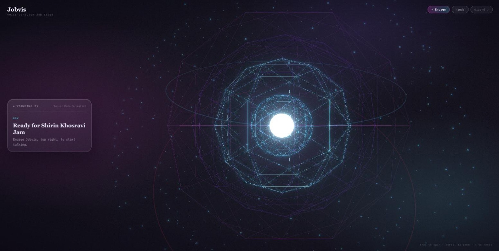

# The Observable Job Agent

<div align="center">
  <h3>Job Scout: a real AI job-matching agent you can see inside</h3>
  <p>Upload your CV (PDF). Get real openings ranked 0 to 100 for fit, honest gap explanations, and a tailored application pack. Then ask for all of it out loud. Every LLM and tool call traced in <a href="https://www.comet.com/docs/opik/">Opik</a> from run one.</p>
  <p><strong>The human applies. The agent never submits.</strong></p>
</div>

<p align="center">
  
  
  
  
  
  
  
</p>

<p align="center">
  
</p>

<br/>

<p align="center">
  
</p>

<p align="center">
  <sub><strong>Jobvis</strong>, the voice console added in Part 4. The orb is the state indicator, and everything beside it came from the checkpoint before a word was said.</sub>
</p>

## 📚 The series

Every part ships as a GitHub release, so the code you clone matches the post you read.

| Part | Focus | Blog post | Code release |
|------|-------|-----------|--------------|
| **1** | **Build** | [Build your own Job Agent - Part 1](https://jamwithai.substack.com/p/build-your-own-job-agent-part-1) | [`part1.0`](https://github.com/jamwithai/observable-job-agent/releases/tag/part1.0) |
| **2** | **Extend, then evaluate** | [Build your own Job Agent - Part 2](https://jamwithai.substack.com/p/build-your-own-job-agent-part-2) | [`part2.0`](https://github.com/jamwithai/observable-job-agent/releases/tag/part2.0) |
| **3** | **Self-improve, with receipts** | [Build your own Job Agent - Part 3](https://jamwithai.substack.com/p/build-your-own-job-agent-part-3) | [`part3.0`](https://github.com/jamwithai/observable-job-agent/releases/tag/part3.0) |
| **4 (this release)** | **Speak** | [Build your own voice agent](https://jamwithai.substack.com/p/build-your-own-voice-agent) | [`part4.0`](https://github.com/jamwithai/observable-job-agent/releases/tag/part4.0) |

```bash
# 📥 Clone the release that matches the part you are reading:
git clone --branch part4.0 https://github.com/jamwithai/observable-job-agent
```

## 🚀 Quick start

Prerequisites: **Python 3.12** (the project pins `>=3.12,<3.13`) and **[uv](https://docs.astral.sh/uv/getting-started/installation/)**. The voice console also needs **Node 20+**.

```bash
git clone --branch part4.0 https://github.com/jamwithai/observable-job-agent
cd observable-job-agent
uv sync --all-groups
cp .env.example .env    # add one LLM key (see below)
make test               # 230 tests, no keys or network needed
make app                # http://localhost:7860
```

**Keys, honestly:**
- Tests, job sources (Remotive + offline cache), and the fabrication validator run with **no keys at all**.
- The agent steps (profile extraction, ranking, tailoring) need **one LLM key**: `OPENAI_API_KEY`, or free via `SCOUT_MODEL=groq:...` (free tier) or `ollama:...` (local).
- Opik tracing has its own free key: [`docs/opik_setup.md`](docs/opik_setup.md).
- The voice console is optional and needs an ElevenLabs key. Everything else works without it.

The app remembers your CV and chosen locations between runs ("Start over" forgets). Jobs are always fetched fresh.

## 🎙️ Jobvis, the voice console (optional, Part 4)

Ask out loud, "find me jobs", and the search starts. Jobvis tells you it has begun, goes quiet while it runs, then breaks the silence itself to say what it found. Ask it to tailor an application and the finished pack appears on screen while it reads you the highlights.

```bash
# 1. Add to .env: an ElevenLabs key with the Agents Platform (Conversational AI)
#    read and write scopes, plus a voice id you have added to My Voices.
#    ELEVENLABS_API_KEY=sk_...
#    ELEVENLABS_VOICE_ID=...      # Voices > My Voices > ... > Copy voice ID
make jobvis-agent     # creates the agent from voice/persona.py, prints the agent id
                      # paste it back as ELEVENLABS_AGENT_ID
make web-build        # npm ci + a Next.js static export into web/out
make app              # wizard on :7860 AND the console on :8000, one process
```

The conversation runs in your **browser** over WebRTC, which is what buys real barge-in and the browser's own echo cancellation, with no audio library to build. Your key never leaves Python: the page asks for a short-lived session token and nothing more.

The grounding contract from Part 2 carries into the new modality. The browser forwards every question and never answers one, so the voice can only say what the LangGraph checkpoint returns. Watch the tool calls appear in the transcript panel as it talks.

Full chapter, including the demo script: [`docs/jobvis.md`](docs/jobvis.md).

## 📓 Interactive tutorials

- [`notebooks/phase3_ollie.ipynb`](notebooks/phase3_ollie.ipynb): per-source timing, the same search with the fan-out on and off, and the assistant walkthrough with what to check each answer against
- [`notebooks/phase2_evaluation.ipynb`](notebooks/phase2_evaluation.ipynb): the tailoring walkthrough, the stale-checkpoint bug live, datasets and eval suites (cost printed before every spend)
- [`notebooks/phase1_walkthrough.ipynb`](notebooks/phase1_walkthrough.ipynb): the search agent end to end, reading your first trace

## ✨ What's inside

- **A four-step wizard** (Resume, Profile, Jobs, Tailor) with streamed progress and a per-run cost footer
- **A voice console** with a Three.js orb that reacts to the real audio spectrum, live panels, and optional webcam hand control
- **You decide where to search**: locations and remote are your call, not the model's guess
- **LLM-driven tool use**: the model picks the search arguments; you watch it choose in the trace
- **Multi-source search**: JSearch, Adzuna, Remotive, plus a committed offline cache
- **Named source failures**: a source that returns nothing says why (quota exhausted, key rejected, timed out) instead of looking like a quiet day
- **Grounded tailoring**: your CV becomes a typed corpus; every rewritten bullet carries a `corpus_ref` back to the real item
- **A deterministic fabrication validator**: zero LLM calls, tunable thresholds (`SCOUT_FAB_*`), every report records the values it ran with
- **PDF rendering with a degradation contract**: LaTeX via tectonic, falls back to `.tex` + Overleaf, never fails a run
- **Per-source spans**: each job site is timed separately, so a slow search names the culprit instead of the total
- **A pipeline regression suite**: `job-scout-search-suite` grades the cascade (no source over 8s, every source used contributed, the search returned something)
- **A prompt tuned against a deterministic check**, not an LLM judge: fabrication 0.2768 to 0.1288 on fresh live jobs
- **The full eval stack in Opik**: datasets from your own traces, experiments, LLM judges, an annotation queue, and judge-vs-human calibration

Stack: LangGraph, LangChain, Opik, Gradio, FastAPI, Next.js + Three.js, ElevenLabs Agents, Pydantic, httpx + pypdf.

## 🏗️ Architecture

CV extraction runs before the graph; the graph has one entry router and two doors:

```
extract_profile(cv) → Profile ─┐
                               ▼
  START → [route_entry] ── no selected job ──→ fetch_jobs → rank_jobs → [enough good matches?]
              │                                    ↑                          │ no
              │                                    └──── reformulate_query ◄──┘   │ yes → END
              └── selected_job_id set ──→ tailor → validate_tailoring → END
                  (reads profile + ranked jobs from the thread's checkpoint; nothing re-runs)
```

- `fetch_jobs`: the model chooses the `search_jobs` arguments (query, country, remote)
- `rank_jobs`: batches of 4 (`SCOUT_RANK_BATCH`), capped at `SCOUT_MAX_JOBS` (default 10); scored jobs are never re-scored
- `reformulate_query`: broadens thin results, at most 2 loops
- `tailor` + `validate_tailoring`: a second invocation on the same thread; the checkpoint is the handoff

The voice surface sits beside the wizard, not underneath it. Both start the same runs and read the same checkpoint, and `make app` runs them in **one process** because the bridge and the checkpoint are process-wide.

Full walkthrough: [`docs/architecture.md`](docs/architecture.md) · Adding a job source: [`docs/extending_sources.md`](docs/extending_sources.md) · The voice console: [`docs/jobvis.md`](docs/jobvis.md)

## 📂 Project structure

```
observable-job-agent/
├── src/job_scout/
│   ├── app.py              # Gradio four-step wizard UI
│   ├── api.py              # FastAPI: voice tokens, tool dispatch, SSE, serves the console
│   ├── voice/              # persona.py (the agent as code), tools.py, bridge.py, announce.py
│   ├── candidate_store.py  # the persisted candidate: profile + CV text + preferences
│   ├── runner.py           # one orchestration path for UI and batch (tracing, cost, latency)
│   ├── profile.py          # CV text → Profile (pre-graph extraction)
│   ├── corpus.py           # your CV as typed, addressable corpus items
│   ├── validation.py       # deterministic fabrication validator (difflib, zero LLM)
│   ├── renderer.py         # Jinja2 → LaTeX → PDF via tectonic (degrades to .tex)
│   ├── evals/              # metrics.py: ProfileFieldAccuracy, FabricationRate, FitExplanationQuality
│   ├── graph/              # graph.py (entry router + search + tailor), state, schemas, nodes/, prompts/
│   ├── templates/          # cv.tex.j2, the single ATS-friendly CV template
│   └── tools/              # jobs_api.py (the source cascade), cv_reader.py, research.py
├── web/                    # the Jobvis console: Next.js + Three.js orb, WebRTC, hand tracking
├── notebooks/              # phase1_walkthrough.ipynb, phase2_evaluation.ipynb, phase3_ollie.ipynb
├── scripts/                # batches, dataset builders, eval suites, annotation queue, agent setup
├── data/                   # cached_jobs.json, fixture_cvs/, fixture_linkedin/, labels/
├── docs/                   # architecture, jobvis, opik_setup, findings, baseline + batch reports
└── tests/                  # 230 tests (LLM mocked, network mocked, Opik off)
```

## 🔧 Commands

```bash
make app           # launch the wizard, and the console if it is built
make test          # run the suite
make jobvis-agent  # create or update the ElevenLabs agent from voice/persona.py
make web-build     # build the console (npm ci + Next.js static export)
make web-dev       # Next dev server on :3000 against the API on :8000
make web-assets    # vendor the MediaPipe hand-tracking assets (optional, ~43MB)
make batch         # Part 1 baseline batch (prints projected cost first)
make tailor-batch  # Part 2 tailoring batch
make eval-datasets # push ranking + tailoring datasets to Opik from traces
make evals         # eval harness (extraction/ranking/tailoring/trajectory/calibration)
make gates         # deterministic regression gate (no LLM calls)
make search-bench  # paired before/after source timing
make queue         # create the Opik annotation queue
make lint          # ruff
```

## 🛠️ Troubleshooting

- **All jobs say `source: cache`**: no live-source keys or no network. Expected; the cache is the offline fallback.
- **"Couldn't read a profile ... api_key"**: add an LLM key to `.env`, or set `SCOUT_MODEL` to a free `groq:`/`ollama:` model.
- **No traces in Opik**: check `OPIK_ENABLED=true`, `OPIK_API_KEY`, `OPIK_WORKSPACE`. See [`docs/opik_setup.md`](docs/opik_setup.md).
- **502 from `/api/voice/token`**: the ElevenLabs key is missing the Agents Platform (Conversational AI) scopes. It returns 401 on the agent endpoints and nowhere else, so everything else looks fine.
- **Jobvis sounds like nobody in particular**: `ELEVENLABS_VOICE_ID` is empty and the name lookup found nothing. A voice is not yours until you add it under Voices > My Voices, and only then does the API list it.
- **The console is not on :8000**: run `make web-build` first. `make app` serves `web/out`, which does not exist until you build it.

**Cost:** reproducing Parts 1 to 3 is a few dollars end to end with API models (the 15-case tailoring batch cost $0.37), or free with local models and free tiers. Part 4 adds ElevenLabs, whose free tier gives about 15 conversation minutes a month; conversation minutes are a separate pool from text-to-speech characters.

---

<div align="center">
  <p><strong>Clone it, add one LLM key, <code>make app</code>, and drop in a fixture CV.</strong></p>
  <p><em>Built with love by <a href="https://jamwithai.substack.com/">Jam with AI</a></em></p>
</div>

## 📄 License

MIT. See [LICENSE](LICENSE).
