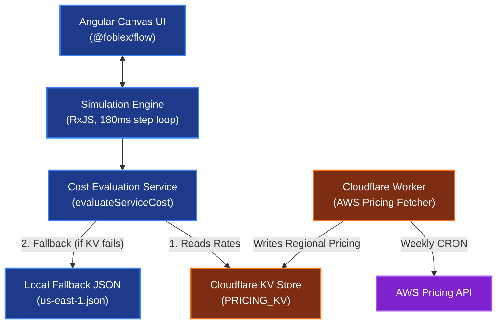
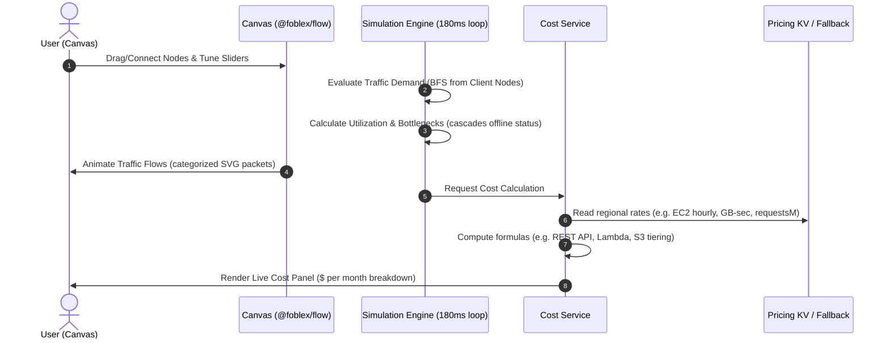

# ☁️ Sr. Architect: AWS System Design Simulator

[](https://angular.io/)
[](https://www.typescriptlang.org/)
[](https://workers.cloudflare.com/)
[](LICENSE)
[](https://github.com/sponsors/000Sushant)

**Learn. Design. Simulate. Optimize.** Sr. Architect is an interactive, browser-based system design simulator and cloud architecture sketchbook. It features a deterministic traffic-and-cost simulation engine that lets you model AWS environments, watch real-time traffic flow, spot bottlenecks under load, and evaluate real-time monthly billing.

---

## ✨ Key Features

### 🏆 Interactive System Design Challenges
Learn cloud engineering and system design by solving real-world challenges directly on the canvas:
- **Guided Scenarios**: Solve design problems such as scaling a URL shortener, building a chat system, or optimizing a video transcoding pipeline.
- **Interactive Scoring & Hints**: Receive instant, data-driven feedback on your architecture's performance, capacity, and cost, alongside guided hints to help you improve.
- **Reference Solutions**: Access architectural diagrams and expert guides detailing the trade-offs and rationale behind every decision.

### 📐 Interactive Architecture Dashboard
Model production-grade topologies with a comprehensive, interactive service palette:
- **60+ Hand-Crafted AWS Services**: Exposes compute, database, networking, serverless, storage, analytics, and security services.
- **Hardware-Level Configurations**: Customize instance sizes (e.g. EC2 `t3.medium` vs `c6g.xlarge`), storage volumes (gp3/io2), DB engine families, read replicas, and caching states.
- **Multi-Canvas Workspace**: Organize your architectures using tabbed views, enabling you to design and compare alternative topologies side-by-side.

### ⚡ Real-Time Traffic & Bottleneck Simulation
Observe how your system behaves under variable workloads with a built-in step simulator:
- **Visual Flow Mapping**: Watch animated SVG packets cascade through nodes along defined paths, showing how data distributes.
- **Dynamic Resource Constraints**: Node-level resources evaluate CPU utilization, queue depth delays, and request limits, warning you of bottlenecks in red.
- **Realistic Failures**: Simulate load-shedding, traffic throttling, server collapses, and offline cascading failures.

### 💰 Live AWS Cost Estimation Engine
Design cost-efficient architectures with a real-time billing dashboard:
- **Live AWS Pricing Sync**: Utilizes a Cloudflare Worker CRON scheduler that pulls regional rate tables from the live AWS Pricing API weekly.
- **Granular Billing Formulas**: Calculates monthly cost estimates reflecting request counts, provisioned throughput, database engines, regional transfer, and tier configurations.
- **Cost Breakdown**: View a detailed, itemized cost panel showing the exact billing impact of each node in your architecture.

---

## ⚙️ Core Simulation Engines

Sr. Architect's interactive simulator runs on two custom, deterministic engines:

### 💓 PulseFlow: Reactive Traffic Simulation Engine
PulseFlow is the reactive heartbeat of the visual workspace, running about 5 times a second (at a steady ~180ms tick interval):
- **Reactive Stream Traversal**: Traverses your active canvas node graph in logical topological flow order using RxJS, ensuring upstream loads accurately cascade down to child nodes.
- **Compounding Backlog Latency**: Rather than simple static metrics, it simulates request queues over time. If a service experiences traffic past its capacity, queue delays build up and latency compounds exponentially tick-by-tick.
- **Hard Server Collapses**: Models physical compute limitations (EC2, ECS, RDS). If load exceeds 150% capacity for more than 1 second, PulseFlow triggers a server crash, forcing the node into a terminal `offline` state.

### 🧩 Rubix: Automated Architecture Rubric Engine
Rubix is a declarative verification and grading engine that analyzes your visual topologies against design challenges:
- **Declarative Rule Parser**: Processes a lightweight JSON rule grammar supporting validation operators like `hasService`, `hasEdge`, `configAtLeast`, `countAtLeast`, and `noOverload`.
- **Live Scoring & Milestones**: Calculates a final design score from 0–100 dynamically, awarding bonus points for best practices (e.g. read replicas) and applying penalties for resource overloads.
- **Topology Compliance Checker**: Cross-references your canvas connections against service specs to immediately flag illegal port configurations (such as connecting a client directly to an internal DB node).

---

## 🗺️ System Architecture

Sr. Architect decouples the canvas UI, the simulation iteration loop, and the live AWS pricing pipelines into a highly efficient distributed topology:



---

## 🔄 Simulation & Cost Lifecycle

Every canvas change triggers a deterministic evaluation loop (running at ~180ms intervals) to evaluate traffic flow, queue depths, bottlenecks, and costs:



---

## 💻 Tech Stack

- **Frontend Core**: Angular 19 (Standalone Components, Signals, RxJS streams)
- **Canvas Engine**: `@foblex/flow` (interactive drawing, port bindings)
- **Worker Infrastructure**: Cloudflare Worker running Wrangler, storing rates in Cloudflare KV.
- **AWS API Integration**: `aws4fetch` for signing requests to the AWS Price List API.
- **Styling**: Premium CSS Glassmorphism Design System.

---

## 🧱 Project Structure

The project is structured with clean separation between the domain logic, simulation handlers, and visual presentation layers. Refer to **[docs/ARCHITECTURE.md](docs/ARCHITECTURE.md)** for a detailed file map.

```
frontend/src/app/
  core/
    models/        # Domain — pure types (no logic, no deps)
    services/      # Application — simulation, cost & validation engines
    constants/     # Shared configuration and magic constants
    data/ config/  # Data-driven core: 64 services described in JSON
  features/        # Presentation — Angular components (canvas, docs, landing)
worker/            # Infrastructure — Cloudflare Worker (pricing scraper)
backend/           # Infrastructure — Express reader serving regional pricing from KV
```

---

## 🚀 Getting Started

### Prerequisites
- Node.js (v20+)
- npm (v10+)

### Installation & Run

#### 1. Clone the repository
```bash
git clone https://github.com/000Sushant/system-design-simulator.git
cd system-design-simulator
```

#### 2. Run the Angular Frontend (Simulator)
```bash
cd frontend
npm install
npm run start
```
The application will launch locally at `http://localhost:4200/`.

#### 3. Run the Cloudflare Worker (Pricing Scraper)
```bash
cd ../worker
npm install
npm run dev
```

#### 4. Run the Pricing Validation Script
Verify local pricing database files match the schema requirements:
```bash
cd ../scripts
npm install
# Set process environment variables or use a local .env file
node --env-file=.env validate-pricing.mjs
```

---

## 🤝 Contributing

Contributions from the community are welcome!
- To report a bug or suggest a feature, please open an issue in the [GitHub Issues](https://github.com/000Sushant/system-design-simulator/issues) page.
- If you'd like to add a new system design challenge, please refer to the [Challenges Guideline](docs/CHALLENGES.md).
- To contribute new service parameters, edit the data JSON files in `frontend/src/app/core/data/` and submit a Pull Request.

---

## 👤 About the Creator

**Sushant Kumar**  
*Backend-focused Full-Stack Engineer and Systems Builder*  
- ✉️ [Email](mailto:000suahntkumar@gmail.com)
- 💼 [LinkedIn](https://linkedin.com/in/sushant--kumar)
- 🌐 [Portfolio](https://000sushant.github.io/sushant-portfolio/)
- 🐙 [GitHub](https://github.com/000Sushant)

---

## 💜 Support the Project
If this tool has helped you learn system design, model cloud environments, or evaluate AWS bills, please consider supporting its development:
> 💖 [**Become a sponsor on GitHub →**](https://github.com/sponsors/000Sushant)

---

Built with ❤️ for the Cloud Community.

**© 2026 Sushant Kumar. All rights reserved.** Licensed under the [GNU General Public License v3.0](LICENSE).
